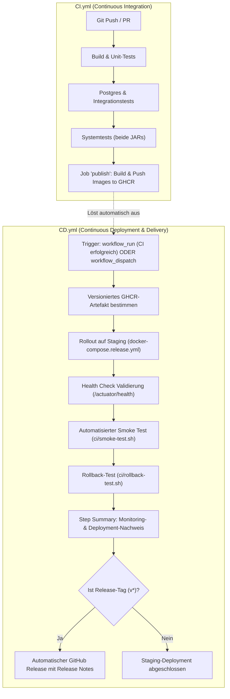

# Dokumentation: P4 – Continuous Deployment & Delivery

**Projektname:** Ticket_System  
**Modul + Gruppe:** M324_Gruppe_4  
**Auftrag:** P4 – Continuous Deployment  

---

## Ziel des Dokuments
In diesem Dokument beschreiben wir die Erweiterung unserer DevOps-Prozesse um **Continuous Delivery (CD)** und **Continuous Deployment (CD)** für das Ticket-System. Aufbauend auf der Test-Pipeline aus [P3](P3_CI_Variantenvergleich.md) und den versionierten Container-Artefakten aus [P3b](P3b_Artifakt_Repository.md) wird der gesamte Release- und Auslieferungsprozess automatisiert.

Das Dokument umfasst:
1. Den Vergleich und die Bewertung mehrerer Bereitstellungs- und Deployment-Ansätze
2. Die Begründung der gewählten Architektur und Plattform-Entscheidung
3. Die Definition und strikte Abgrenzung der Umgebungen (Dev, QA/Staging, Production)
4. Den sicheren Umgang mit Konfigurationen und Secrets (12-Factor App)
5. Den lückenlosen Nachweis der verwendeten versionierten Artefakte
6. Die Pipeline-Architektur mit Trennung von `CI.yml` und `CD.yml`
7. Rollout-Strategien, Skalierung und Ausfallsicherheit (inkl. Kubernetes & Blue/Green Setup)
8. Die Validierung mittels Spring Boot Actuator Health Checks, Docker Healthchecks und automatisierten Smoke Tests
9. Die Rollback-Strategie inklusive praktischer Verifikation / Simulation
10. Eine Analyse der offenen Risiken und Gegenmassnahmen
11. Den Nachweis des vollen Lehrperson-Zugriffs

---

## 1. Vergleich der Bereitstellungs- und Deployment-Ansätze

Gemäss den Anforderungen haben wir mehrere grundlegende Ansätze für die Bereitstellung und Auslieferung unseres Microservice-Systems analysiert:

### Die Ansätze im Detail

1. **Direktes Kompilieren & Installation auf Server (Bare-Metal / VM mit systemd)**
   - *Prinzip:* Der Sourcecode oder das JAR wird direkt auf die Zielmaschine übertragen. Java 21 und PostgreSQL sind als Systemdienste vorinstalliert. Ein systemd-Service verwaltet den Lebenszyklus des Java-Prozesses.
   - *Vorteile:* Kein Container-Overhead, sehr transparentes OS-Monitoring.
   - *Nachteile:* Starke Umgebungsabhängigkeit ("Works on my machine"-Problem), mühsame Updates von Java-Versionen, fehlende Isolation zwischen den Microservices, schwierige Skalierung.

2. **Einzelne Container (`docker run`)**
   - *Prinzip:* Die Anwendung läuft in Docker-Containern, wird aber manuell oder über einfache Shell-Skripte mit `docker run` gestartet.
   - *Vorteile:* Gute Isolation, reproduzierbare Laufzeitumgebung.
   - *Nachteile:* Vernetzung, Volumes und Abhängigkeiten (z. B. PostgreSQL vor Microservice starten) müssen manuell geskriptet werden. Fehleranfällig und schlecht wartbar.

3. **Container-Composition (`docker compose`)**
   - *Prinzip:* Deklarative Definition aller Services, Netzwerke, Volumes und Health Checks in einer YAML-Datei (`docker-compose.release.yml`).
   - *Vorteile:* Sehr einfache Handhabung, deklarative Health Checks (`depends_on: condition: service_healthy`), identische Ausführung lokal und auf CI/CD-Runnern, keine Lizenz- oder Cloud-Kosten.
   - *Nachteile:* Standardmässig auf einen einzelnen Host beschränkt; kein automatisches Cross-Node-Load-Balancing ohne Zusatztools.

4. **Container-Orchestrierung mit Docker Swarm**
   - *Prinzip:* Integriertes Clustering von Docker mit Service-Deklaration, Routing Mesh und Rolling Updates über mehrere Server hinweg.
   - *Vorteile:* Geringere Einstiegshürde als Kubernetes, Rolling Updates nativ unterstützt.
   - *Nachteile:* In der Industrie weitgehend durch Kubernetes verdrängt, schrumpfendes Ökosystem.

5. **Kubernetes (K8s / K3s / AWS EKS)**
   - *Prinzip:* Der Industriestandard für Container-Orchestrierung. Verwaltet Pods, Services, Ingress, Deployments, Rolling Updates und Horizontal Pod Autoscaling (HPA) über Nodes hinweg.
   - *Vorteile:* Maximale Skalierbarkeit, Ausfallsicherheit durch Selbstheilung (Self-Healing), native Rolling Updates ohne Downtime, feingranulares Secret-Management.
   - *Nachteile:* Hohe Komplexität und Konfigurationsaufwand, ressourcenintensiv für ein kleines Projekt.

6. **Cloud-Native Serverless CaaS (AWS ECS mit AWS Fargate)**
   - *Prinzip:* Container-Ausführung ohne Server-Verwaltung in AWS. Anbindung an Application Load Balancer (ALB), AWS Secrets Manager und RDS PostgreSQL.
   - *Vorteile:* Keine Serverwartung, elastische Skalierung, tiefe Integration in AWS IAM und CloudWatch.
   - *Nachteile:* Bindung an einen Cloud-Provider (Vendor Lock-in), laufende Cloud-Kosten, zwingend AWS-Konto und Credentials für die Ausführung nötig.

---

### Vergleichsmatrix

| Kriterium | Bare-Metal / VM | Einzelne Container | Docker Compose | Docker Swarm | Kubernetes (K8s) | AWS Fargate |
|---|---|---|---|---|---|---|
| **Komplexität** | Gering | Gering bis mittel | **Gering (optimal)** | Mittel | Hoch | Mittel bis hoch |
| **Isolierung & Portabilität** | Gering | Hoch | **Sehr hoch** | Sehr hoch | Sehr hoch | Sehr hoch |
| **Microservice-Orchestrierung** | Manuell | Mühsam (Bash) | **Deklarativ & elegant** | Deklarativ | Deklarativ (mächtig) | Deklarativ (AWS Task Def) |
| **Horizontale Skalierung** | Aufwendig | Manuell | Eingeschränkt (`--scale`) | Nativ | **Hervorragend (HPA)** | Sehr gut (Autoscaling) |
| **Zero-Downtime Rollout** | Kaum machbar | Schwer | Mit Blue/Green & Nginx | Nativ (Rolling) | **Nativ (Rolling / Blue-Green)** | Nativ (Rolling / Blue-Green) |
| **Ressourcenbedarf & Kosten** | Niedrig | Niedrig | **Sehr niedrig (0 CHF)** | Niedrig | Hoch | Pay-per-Use (Cloud-Kosten) |
| **Automatisierbarkeit in CI/CD** | Mittel | Mittel | **Sehr hoch (GitHub Runner)** | Hoch | Hoch | Hoch |
| **Zugriff für Lehrperson** | Eingeschränkt | Eingeschränkt | **100% garantiert** | Eingeschränkt | Benötigt K8s-Cluster | Benötigt AWS-Zugang |

---

## 2. Plattform-Entscheidung & Begründung

### Gewählte Primärlösung für CI/CD: Docker Compose Release (Staging-Automatisierung)
Für die vollautomatische CD-Pipeline in GitHub Actions setzen wir primär auf **Docker Compose mit den publizierten GHCR-Images** ([`docker-compose.release.yml`](../Code/Ticket_System/docker-compose.release.yml)):

1. **Garantierter Lehrperson-Zugriff:** Jeder GitHub Actions Runner (`ubuntu-latest`) kann Docker Compose sofort ohne externe Cloud-Accounts, VPC-Konfigurationen oder Secrets ausführen.
2. **Build once, deploy many:** Die Pipeline bezieht exakt die in P3b gebauten und getesteten Images aus der GitHub Container Registry (`ghcr.io/yaracorder0/m324_gruppe4/...`).
3. **Echtes Systemverhalten:** Durch Docker Healthchecks auf Spring Boot Actuator (`/actuator/health`) starten die Services deterministisch in der richtigen Reihenfolge (Postgres -> Employee-Service -> Ticket-Service).
4. **Reproduzierbarkeit:** Jedes Gruppenmitglied und die Lehrperson können dieselbe Staging-Umgebung mit einem einzigen Befehl lokal oder auf einem Server starten:
   ```bash
   IMAGE_TAG=1.0.0 docker compose -f Code/Ticket_System/docker-compose.release.yml up -d
   ```

### Konzeptioneller Alternativ-Ansatz: Kubernetes & Cloud-Skalierung (m346 / m347)
Als alternativen Ansatz haben wir das Gelernte aus den Modulen **m346 (Cloud)** und **m347 (Dienste mit Containern)** analysiert und eine Bereitstellung in einem Kubernetes-Cluster (z. B. AWS EKS) konzipiert:
- **Zero-Downtime Rollout:** Ein Kubernetes `Deployment` mit `RollingUpdate`-Strategie (`maxUnavailable: 0`, `maxSurge: 1`) stellt sicher, dass alte Pods erst beendet werden, wenn neue Pods über Readiness-Probes (`/actuator/health`) gesunden Zustand melden.
- **Horizontale Autoskalierung:** Mittels `HorizontalPodAutoscaler` (HPA) können die zustandslosen Microservice-Pods bei steigender Last (z. B. CPU > 75%) dynamisch von 2 auf bis zu 5 Instanzen hochskaliert werden.
- **Ingress & Load Balancing:** Ein Ingress-Controller (bzw. AWS Application Load Balancer ALB) übernimmt SSL-Termination und das Routing auf `/api/employees` und `/api/tickets`.
- **Fazit:** Dieser Ansatz ist ideal für stark frequentierte Produktivsysteme mit Hochverfügbarkeitsanforderung. Für unsere automatisierte CI/CD-Pipeline und die Bewertbarkeit durch die Lehrperson ist Docker Compose jedoch die pragmatischere und verlässlichere Wahl, da sie ohne fremde Cloud-Kosten oder Zugangsdaten sofort auf jedem Runner durchläuft.

---

## 3. Definition und Abgrenzung der Umgebungen

Für eine verlässliche Automatisierung unterscheiden wir klar zwischen **Development**, **QA / Staging** und **Production**:

| Eigenschaft | Development (Dev) | QA / Staging (Abnahme) | Production (Prod) |
|---|---|---|---|
| **Zweck** | Schnelle Entwicklung, lokales Debugging, Ausführen von Unit- & Integrationstests | Automatisierte Systemtests, Smoke Tests, Validierung des Release-Kandidaten | Echter Anwendungsbetrieb für Endbenutzer |
| **Host / Plattform** | Lokale Entwickler-Laptops (Docker Desktop) | GitHub Actions Runner (`docker-compose.release.yml`) | GitHub Actions Runner (`docker-compose.release.yml`), identische Konfiguration wie Staging |
| **Artefakt-Quelle** | Lokaler Build (`mvn package`, lokale Dockerfiles) | **Nur publizierte GHCR-Images** mit Commit-SHA (`sha-xxxx`) oder Release-Tag | **Nur freigegebene GHCR-Images** mit SemVer-Tag (z. B. `1.0.0`) |
| **Datenbestand** | Lokale PostgreSQL mit Test-Seeds (`init-scripts/01-init.sql`) | Isoliertes PostgreSQL im Container, bei jedem Lauf frisch aus dem Init-Skript | Isoliertes PostgreSQL im Container (ohne persistentes Volume, siehe Restrisiken) |
| **Trigger / Branch** | Jeder lokale Entwicklungsstand, Feature-Branches (`feature/**`) | **Vollautomatisch** nach erfolgreicher CI auf `main` oder bei Release-Tags | **Freigabebasiert** (Manual Approval / Git-Tag `v*`) |
| **Logging & Actuator** | Spring-Boot-Standard, Actuator mit Details | Actuator Health mit Details, wird von Healthchecks und Smoke Tests ausgewertet | Aktuell identisch zu Staging. Für einen echten Produktivbetrieb müssten die Detail-Ausgaben eingeschränkt werden (siehe Abschnitt 4) |
| **Netzwerk & Ports** | Ports 8081, 8082, 5433 direkt auf `localhost` gemappt | Container im isolierten Docker-Netzwerk, Ports 8081/8082 für den Smoke Test gebunden, Datenbank nicht nach aussen exponiert | Identisch zu Staging. In der Blue/Green-Variante zusätzlich ein nginx-Proxy auf 18081/18082 |

### Abgrenzung: Was unsere "Production" ist und was nicht
Unsere Production-Umgebung ist **dieselbe Docker-Compose-Umgebung wie Staging**, die auf einem GitHub Actions Runner ausgeführt wird. Sie unterscheidet sich von Staging nicht durch die Infrastruktur, sondern durch den **Prozess**:

| | Staging | Production |
|---|---|---|
| Auslöser | Merge auf `main` | Release-Tag `v*` |
| Artefakt | `sha-<commit>` (jeder getestete Commit) | SemVer-Tag (bewusst freigegebene Version) |
| Freigabe | keine, vollautomatisch | manuelle Freigabe im GitHub Environment |
| Ergebnis | Deployment-Nachweis | zusätzlich ein GitHub Release |

Ein dauerhaft laufender Server (Cloud-VM, Kubernetes-Cluster) steht uns im Projektrahmen nicht zur Verfügung. Die Umgebung existiert deshalb nur für die Dauer des Pipeline-Laufs. Was das für den Realitätsgrad bedeutet, ist in den [Restrisiken](#10-restrisiken-und-gegenmassnahmen) beschrieben.

---

## 4. Konfigurations- und Secret-Handling (Sicherheit)

Wir halten uns strikt an die Grundsätze der **12-Factor App (Faktor III: Config)**: Code und Konfiguration sind vollständig getrennt.

### Trennung von Code und Konfiguration
- **Keine Passwörter oder Geheimnisse im Quellcode:** Weder in `pom.xml`, Java-Klassen noch in Dockerfiles stehen produktive Zugangsdaten.
- **Spring Boot Externalized Configuration:** Die Microservices verwenden in `application.properties` neutrale Standardwerte für die lokale Entwicklung, die zur Laufzeit prioritär über Umgebungsvariablen überschrieben werden:

| Variable | Beschreibung | Standard (Dev) | Staging / Produktion |
|---|---|---|---|
| `SPRING_DATASOURCE_URL` | JDBC-Verbindungs-URL | `jdbc:postgresql://localhost:5433/...` | `jdbc:postgresql://postgres:5432/...` |
| `SPRING_DATASOURCE_USERNAME` | Datenbank-Benutzer | `ticket_user` | Aus Secret / Umgebungsvariable |
| `SPRING_DATASOURCE_PASSWORD` | Datenbank-Passwort | `ticket_password` | Aus Secret / Umgebungsvariable |
| `EMPLOYEE_SERVICE_URL` | Inter-Service-Kommunikation | `http://localhost:8081/api/employees` | `http://employee-service:8081/api/employees` |

### Secret-Handling in den Umgebungen
1. **Entwicklung (Dev):** Unkritische Dummy-Passwörter in lokalen Containern. Lokale Konfigurationen via `.gitignore` geschützt.
2. **CI/CD & Staging:**
   - Authentifizierung an der GitHub Container Registry über das flüchtige, automatisch generierte `${{ secrets.GITHUB_TOKEN }}`.
   - Least Privilege: Lese- und Schreibrechte werden in der Pipeline nur dort vergeben, wo sie zwingend gebraucht werden (`packages: write` nur beim Publish).
3. **Produktion:**
   - Aktuell werden die Datenbank-Zugangsdaten als Umgebungsvariablen im Compose-File gesetzt. Es handelt sich um reine Testwerte für einen Container ohne echte Daten.
   - Für einen echten Produktivbetrieb: Ablage als **GitHub Actions Secret** und Injektion beim Deployment, in Kubernetes als `kind: Secret`, in AWS über den **Secrets Manager** bzw. **Parameter Store**.
4. **Schutz sensibler Endpunkte:**
   - Über `management.endpoints.web.exposure.include=health,info` sind nur die beiden unkritischen Endpunkte aktiv. Endpunkte wie `env`, `beans` oder `heapdump`, die Konfiguration und Speicherinhalte preisgeben würden, sind **nicht** exponiert.
   - `/actuator/health` liefert derzeit mit `show-details=always` zusätzlich den Zustand von Datenbank, Speicherplatz und SSL. Diese Details enthalten keine Zugangsdaten, sind aber für die automatische Auswertung in Healthcheck und Smoke Test nötig.
   - **Für einen echten Produktivbetrieb** würden wir auf `management.endpoint.health.show-details=when_authorized` wechseln und die Actuator-Endpunkte nur im internen Netz erreichbar machen.
5. **Passwort-Sicherheit (Ausblick, aktuell nicht umgesetzt):**
   - Unser Ticket-System besitzt in Version 1.0 **keine Benutzerverwaltung und keine Authentifizierung**. Es werden deshalb keine Benutzerpasswörter gespeichert, und die API ist ohne Login erreichbar.
   - Sobald eine Anmeldung ergänzt wird, setzen wir die in unserer Theoriearbeit ([T4](../Theorie/T4_Theorie_Continuous_Deployment.md)) erarbeitete Lösung um: Hashing mit **BCrypt** (individuelles Salt, anpassbarer Cost Factor) über Spring Security.
   - Die einzigen Zugangsdaten im aktuellen System sind die Datenbank-Credentials, die über Umgebungsvariablen gesetzt werden (siehe Tabelle oben).

---

## 5. Nachweis der versionierten Artefakte

Gemäss dem Leitsatz **"Build once, deploy many"** wird der Code während des Deployments **nicht neu kompiliert oder neu gebaut**. Stattdessen wird exakt das in der CI-Stufe [P3b](P3b_Artifakt_Repository.md) gebaute und in der GitHub Container Registry (GHCR) abgelegte Docker-Image bezogen.

### Eindeutige Identifikation des Artefakts

```
ghcr.io/<owner>/m324_gruppe4/<service>:<tag>
```

- **Staging-Deployment auf `main`:** Verwendet das Tag `sha-<commit>` (z. B. `sha-4a2b91c`), das unveränderlich an den Git-Commit gebunden ist.
- **Produktions-/Release-Deployment:** Verwendet das Semantic Versioning Tag (z. B. `1.0.0`), das durch den Git-Tag `v1.0.0` ausgelöst wurde.
- **Image Digest:** Jedes Image besitzt einen kryptografischen SHA-256 Digest (z. B. `sha256:d89f...`), der Manipulationen ausschliesst.

### Artefakt-Bezug
```bash
# Beziehen des versionierten Artefakts ohne Build
docker pull ghcr.io/yaracorder0/m324_gruppe4/employee-service:sha-4a2b91c
docker pull ghcr.io/yaracorder0/m324_gruppe4/ticket-service:sha-4a2b91c
```

---

## 6. Pipeline-Architektur: Trennung von CI und CD

Auf Basis unseres Architektur-Reviews haben wir uns bewusst für eine **saubere Trennung der Pipelines** entschieden:
- [`.github/workflows/CI.yml`](../.github/workflows/CI.yml): Continuous Integration & Artefakt-Publishing
- [`.github/workflows/CD.yml`](../.github/workflows/CD.yml): Continuous Deployment & Delivery (Rollout-Strategie *Recreate*)
- [`.github/workflows/CD-BlueGreen.yml`](../.github/workflows/CD-BlueGreen.yml): Vergleichsvariante mit der Rollout-Strategie *Blue/Green*

### Zusammenspiel der Workflows



### Trigger-Konfiguration in `CD.yml`
1. **`workflow_run`:** Startet automatisch, sobald der Workflow `CI (V2)` erfolgreich abgeschlossen ist. Woher der CI-Lauf stammt, entscheidet über Umgebung und Artefakt:

| Auslösender CI-Lauf | Umgebung | Image-Tag | Freigabe |
|---|---|---|---|
| Push auf `main` | `staging` | `sha-<commit>` | keine, vollautomatisch (**Continuous Deployment**) |
| Release-Tag `v1.0.0` | `production` | `1.0.0` | manuelle Freigabe im GitHub Environment (**Continuous Delivery**) |

2. **`workflow_dispatch`:** Ermöglicht den manuellen Start durch Entwickler oder die Lehrperson mit individueller Parameterauswahl:
   - `image_tag`: Angabe des gewünschten Version-Tags (auch für gezielte Rollbacks auf frühere Versionen)
   - `environment`: Wahl zwischen `staging` und `production`
   - `simulate_rollback`: Optionale Ausführung des praktischen Rollback-Tests

### Continuous Delivery: manuelle Freigabe für Production
Der Deploy-Job ist einem **GitHub Environment** zugeordnet (`staging` bzw. `production`). Für `production` ist in den Repository-Settings unter *Environments → production → Required reviewers* ein Teammitglied hinterlegt. Dadurch:
- läuft ein Deployment auf Staging **vollautomatisch** durch (Continuous Deployment),
- **wartet** ein Production-Deployment auf die manuelle Freigabe durch eine Person (Continuous Delivery),
- ist im Environment-Verlauf nachvollziehbar, wer welche Version freigegeben hat.

Nach erfolgreichem Production-Deployment publiziert der Job `release` automatisch einen **GitHub Release** mit Release Notes und den Referenzen auf die versionierten Artefakte.

> Screenshot der Environment-Freigabe (Required reviewer) und des erzeugten GitHub Release: _TODO_

---

## 7. Rollout-Konzepte, Skalierung & Ausfallsicherheit

### Rollout-Strategien im Vergleich

| Strategie | Ablauf | Downtime | Ressourcen | Geeignet für |
|---|---|---|---|---|
| **Recreate** | Alte Container stoppen -> Neue Container starten | Gering (ca. 5–15s) | Minimal (1x) | Dev, Staging, kleinere interne Tools |
| **Rolling Update** | Instanzen werden sukzessive einzeln ersetzt | **Zero Downtime** | Moderat (+1 Instanz) | Kubernetes, Standard-Produktion |
| **Blue/Green** | Parallele Umgebung (Green) hochfahren, testen, Traffic per Load Balancer umleiten | **Zero Downtime** | Hoch (2x Infrastruktur) | Kritische Produktivsysteme, Instant Rollback |
| **Canary** | 5–10% des Verkehrs auf neue Version leiten, Metriken überwachen, dann steigern | **Zero Downtime** | Flexibel | Sehr grosse Cloud-Plattformen mit vielen Nutzern |

### Bewertung der Rollout-Strategien für unser Projekt

Wir haben **zwei Rollout-Strategien umgesetzt und getestet** und eine dritte konzeptionell bewertet:

#### Umgesetzte Variante 1: Recreate mit Health Check Verifikation ([`CD.yml`](../.github/workflows/CD.yml))
Die Umgebung nutzt `docker-compose.release.yml`. Der Container-Tausch dauert nur wenige Sekunden. Nach dem Start blockiert der Workflow, bis die Actuator Health Checks beider Services `UP` melden, anschliessend validiert der Smoke Test die Funktionsfähigkeit.
- *Vorteil:* Sehr schlanke Konfiguration, nur eine Umgebung nötig.
- *Nachteil:* Kurze Downtime während des Container-Tauschs, ein Rollback erfordert ein erneutes Deployment (gemessene MTTR ca. 16s).
- *Einsatz bei uns:* Standard-Rollout für Staging und Production.

#### Umgesetzte Variante 2: Blue/Green mit nginx ([`CD-BlueGreen.yml`](../.github/workflows/CD-BlueGreen.yml))
Zwei vollständige Umgebungen laufen parallel als eigene Compose-Projekte (`ticket-system-blue`, `ticket-system-green`), davor ein nginx-Reverse-Proxy. Umgesetzt in [`ci/bluegreen-deploy.sh`](../Code/Ticket_System/ci/bluegreen-deploy.sh) und [`ci/bluegreen-switch.sh`](../Code/Ticket_System/ci/bluegreen-switch.sh):

1. Die neue Version wird in die **inaktive** Farbe ausgerollt, während die aktive weiterhin allen Traffic bedient.
2. Der Smoke Test läuft direkt gegen die inaktive Umgebung. Schlägt er fehl, wird **nicht** umgeschaltet und die Nutzer merken nichts vom fehlerhaften Release.
3. Erst bei Erfolg schaltet der nginx-Proxy den Traffic um (Konfiguration ersetzen und `nginx -s reload`).
4. Ein weiterer Smoke Test über den Proxy bestätigt den Wechsel.
5. Die alte Umgebung läuft weiter, dadurch ist der Rollback ein reiner Traffic-Switch.

- *Vorteil:* Zero Downtime, fehlerhafte Releases erreichen die Nutzer nie, Rollback in Sekunden.
- *Nachteil:* Doppelte Infrastruktur (zwei Datenbanken, vier Service-Container), höhere Komplexität.
- *Einsatz bei uns:* Als Vergleichsvariante umgesetzt und getestet.

**Nachweis aus unserem lokalen Testlauf:**
```
[BLUE/GREEN] Rollout von Version v2
 Aktive Umgebung:  blue
 Ziel-Umgebung:    green (inaktiv)
[Schritt 2/4] Smoke Test gegen die inaktive Umgebung (kein Nutzer-Traffic)
[Schritt 3/4] Traffic auf green umschalten
 BLUE/GREEN ROLLOUT ERFOLGREICH -> Aktiv: green (Version v2)

--> Schalte Traffic von green auf blue
[+] Traffic laeuft jetzt auf blue (Dauer inkl. Validierung: 2s)
```
Während des Umschaltens haben wir parallel alle 0.25s Anfragen gegen den Proxy gesendet: **60 von 60 Anfragen wurden mit HTTP 200 beantwortet**, der Wechsel erfolgte also ohne Ausfall.

> Log-Auszug aus einem Lauf des Workflows `CD Variante Blue/Green` auf GitHub Actions: _TODO_

#### Konzeptionell bewertet: Rolling Update
In einer Kubernetes- oder Cloud-Umgebung (z. B. AWS ECS/EKS) würden wir auf `RollingUpdate` setzen. Neue Container werden hochgefahren und erst nach bestandenem Health Check in den Load Balancer aufgenommen, bevor die alten heruntergefahren werden. Mit reinem Docker Compose ist das nicht sinnvoll abbildbar, da ein Loadbalancer mit dynamischer Service-Discovery fehlt.

### Skalierbarkeit und Ausfallsicherheit (Architektur-Analyse)
- **Stateless Microservices:** Weder `employee-service` noch `ticket-service` halten lokalen Sitzungszustand im Speicher. Jede Anfrage ist unabhängig, der gesamte Zustand liegt in PostgreSQL. Damit sind beide Services horizontal skalierbar.
- **Skalierung mit Docker Compose:** Der Befehl `docker compose up --scale ticket-service=3` funktioniert **nicht direkt** mit unserer Release-Konfiguration, weil ein fester Host-Port (`8082:8082`) nur einmal vergeben werden kann. Für mehrere Instanzen braucht es einen vorgelagerten Loadbalancer, der die Container über das Docker-Netzwerk anspricht. Genau diese Komponente bringt unsere Blue/Green-Variante bereits mit (siehe unten).
- **Kubernetes:** Automatische Skalierung via **Horizontal Pod Autoscaler (HPA)** zwischen 2 und 5 Pods basierend auf CPU-Auslastung (> 75%).
- **Ressourcenbegrenzung:** In [`docker-compose.release.yml`](../Code/Ticket_System/docker-compose.release.yml) sind pro Container Limits gesetzt (`mem_limit`, `cpus`), damit ein einzelner Container den Host nicht blockiert.
- **Self-Healing:** Alle Container laufen mit `restart: unless-stopped`. Stürzt ein Prozess ab, startet Docker den Container automatisch neu.

#### Horizontale Skalierung über den Blue/Green-Proxy
Der nginx-Proxy aus unserer Blue/Green-Variante ist die Grundlage für echte horizontale Skalierung, da die Services nicht mehr direkt über feste Host-Ports angesprochen werden:

1. Im Compose-File wird die Port-Bindung der Services entfernt, sie sind dann nur noch im Docker-Netzwerk erreichbar.
2. `docker compose -p ticket-system-blue up -d --scale ticket-service=3` startet drei Instanzen im selben Netzwerk.
3. Im nginx wird pro Service ein `upstream`-Block mit den Instanzen definiert, nginx verteilt die Anfragen per Round Robin:

```nginx
upstream ticket_backend {
  server ticket-system-blue-ticket-service-1:8082;
  server ticket-system-blue-ticket-service-2:8082;
  server ticket-system-blue-ticket-service-3:8082;
}
server {
  listen 81;
  location / { proxy_pass http://ticket_backend; }
}
```

4. Fällt eine Instanz aus, nimmt nginx sie aus der Verteilung und die übrigen Instanzen bedienen den Traffic weiter (Ausfallsicherheit innerhalb einer Farbe).

Umgesetzt und getestet haben wir den Proxy mit je einer Instanz pro Farbe, da unser Lastprofil im Projektrahmen keine Mehrfachinstanzen erfordert. Die Erweiterung auf mehrere Instanzen beschränkt sich auf die oben gezeigte `upstream`-Konfiguration.
- **Stateful Database:** PostgreSQL ist zustandsbehaftet. In Kubernetes sichern wir dies über ein `PersistentVolumeClaim` (PVC) ab. Im Cloud-Betrieb (AWS) wird dies über einen Managed Service wie **Amazon RDS** mit Multi-AZ-Replikation realisiert.

---

## 8. Validierung: Smoke Tests, Health Checks & Monitoring

Ein Deployment gilt erst dann als erfolgreich, wenn automatische Prüfungen die Funktionsfähigkeit nachweisen.

### 1. Spring Boot Actuator Health Checks
Beide Microservices stellen den standardisierten Endpunkt `/actuator/health` bereit. Dieser prüft:
- Ob der Java-Prozess lebt (Liveness)
- Ob die Verbindung zur PostgreSQL-Datenbank aktiv und ansprechbar ist (Readiness)

**Rückgabe bei gesunder Verbindung (HTTP 200):**
```json
{
  "status": "UP",
  "components": {
    "db": {
      "status": "UP",
      "details": {
        "database": "PostgreSQL",
        "validationQuery": "isValid()"
      }
    },
    "diskSpace": {
      "status": "UP"
    },
    "ping": {
      "status": "UP"
    }
  }
}
```

### 2. Docker Compose Health Checks
In [`docker-compose.release.yml`](../Code/Ticket_System/docker-compose.release.yml) führen die Container zyklische Health Checks durch:
```yaml
healthcheck:
  test: ["CMD-SHELL", "wget -qO- http://localhost:8081/actuator/health | grep -q '\"status\":\"UP\"' || exit 1"]
  interval: 5s
  timeout: 3s
  retries: 25
  start_period: 15s
```
Dadurch startet der `ticket-service` erst, wenn sowohl die Datenbank als auch der `employee-service` nachweislich `healthy` sind.

### 3. Automatisierter Smoke Test ([`ci/smoke-test.sh`](../Code/Ticket_System/ci/smoke-test.sh))
Nach dem Rollout führt die Pipeline den Smoke Test aus:
- **Schritt 1:** Abfrage der Health-Status beider Services
- **Schritt 2:** Anlage und Abruf eines Test-Mitarbeiters via `POST /api/employees` und `GET /api/employees/{id}`
- **Schritt 3:** Anlage und Abruf eines Tickets via `POST /api/tickets` unter Referenzierung des neuen Mitarbeiters (Verifikation der Inter-Service-Kommunikation!)
- **Schritt 4:** Erfolgsmeldung (Exit-Code 0) oder Abbruch mit Fehlercode 1 bei fehlerhafter Antwort.

Unter Windows wird das Skript über Git Bash ausgeführt (`bash ci/smoke-test.sh`).

### 4. Monitoring-Nachweis in der Pipeline
Die CD-Pipeline schreibt nach jedem Lauf einen zusammenfassenden Bericht direkt in das **GitHub Step Summary**:
- Name und Digest des deployten Artefakts
- Live-Ausgabe des `/actuator/health`-Endpunkts
- Tabellarischer Container-Status (`docker compose ps`)
- Auszug der letzten Container-Logs zur Fehler- und Leistungsdiagnose

---

## 9. Rollback-Strategie & Nachweis der praktischen Prüfung

Trotz aller Tests kann es im Live-Betrieb zu unvorhergesehenen Fehlern kommen (z. B. fehlerhafte Umgebungsvariablen, Deadlocks oder unentdeckte Regressionen). Ein automatisierter Notfallplan ist unverzichtbar.

### Rollback-Konzept
1. **Erkennung:** Der Post-Deployment Smoke Test oder der Actuator Health Check schlägt fehl.
2. **Alarmierung:** Die Pipeline bricht den Rollout sofort ab und markiert das Deployment als fehlgeschlagen.
3. **Automatisches Re-Deployment:** Die Pipeline startet automatisch den vorherigen stabilen Image-Tag (`IMAGE_TAG_PREVIOUS`, z. B. `1.0.0` oder der vorherige Commit-SHA).
4. **Validierung:** Der Smoke Test läuft erneut gegen die wiederhergestellte Version.

### Herausforderung Datenbank & Multi-Step Migration
Wie in unserer Theoriearbeit ([T4](../Theorie/T4_Theorie_Continuous_Deployment.md#was-stellt-die-grösste-herausforderung-bei-einem-rollback-dar)) festgehalten, ist die Datenbank das grösste Risiko bei Rollbacks:
- Wenn Version 2 eine Spalte löscht und ein Rollback auf Version 1 erfolgt, stürzt Version 1 ab.
- **Lösung (Expand and Contract Pattern):**
  1. *Expand:* Neue Spalten/Tabellen werden hinzugefügt (nullable oder mit Default-Werten). Alte Felder bleiben bestehen.
  2. *Parallel Run:* Die neue Softwareversion schreibt in beide Strukturen. Ein Rollback auf die Vorversion ist jederzeit verlustfrei möglich.
  3. *Contract:* Erst wenn Version 2 über längere Zeit stabil in Produktion läuft, werden alte Felder in einer separaten Migration bereinigt.

### Praktischer Nachweis: Rollback-Test ([`ci/rollback-test.sh`](../Code/Ticket_System/ci/rollback-test.sh))
Um die Funktionsfähigkeit der Rollback-Strategie zu beweisen, führt die Pipeline nach jedem Rollout einen echten Rollback-Test an der laufenden Umgebung durch:

1. **Ausgangslage prüfen:** Der Smoke Test bestätigt, dass die stabile Version läuft.
2. **Fehlerhaftes Release ausrollen:** Der `employee-service` wird über die Override-Datei [`ci/docker-compose.broken.yml`](../Code/Ticket_System/ci/docker-compose.broken.yml) mit einer ungültigen Datenbank-URL neu gestartet. Das entspricht einem realistischen Fehlerfall (falsche Konfiguration, nicht erreichbare Datenbank).
3. **Fehlererkennung:** Der Smoke Test läuft gegen das fehlerhafte Release und **muss** fehlschlagen. Schlägt er nicht fehl, bricht der Test mit Exit-Code 1 ab, denn dann würde der Mechanismus einen echten Fehler nicht erkennen.
4. **Automatischer Rollback:** Die Umgebung wird mit dem stabilen Image-Tag neu ausgerollt.
5. **Validierung:** Ein erneuter Smoke Test bestätigt die Wiederherstellung, und die Zeit bis zur Wiederherstellung (MTTR) wird gemessen.

Der Test ist nur dann erfolgreich, wenn der Fehler erkannt **und** der Rollback validiert wurde.

**Log-Auszug eines lokalen Testlaufs:**
```
[Schritt 1/5] Ausgangslage pruefen: laeuft die stabile Version?
[+] Stabile Version test laeuft und ist funktionsfaehig.
[Schritt 2/5] Fehlerhaftes Release ausrollen (ungueltige Datenbank-Konfiguration)
[Schritt 3/5] Post-Deployment Smoke Test (muss fehlschlagen)
[!] ALARM: Smoke Test fehlgeschlagen, fehlerhaftes Release wurde erkannt.
[Schritt 4/5] AUTOMATISCHER ROLLBACK auf die stabile Version test
[Schritt 5/5] Validierung nach dem Rollback
 ROLLBACK-TEST BESTANDEN
 - Zeit bis zur Wiederherstellung (MTTR): 16s
```

> Log-Auszug aus einem Pipeline-Lauf auf GitHub Actions: _TODO_

---

## 9b. Nicht umgesetzt: Feature Toggles
In unserer Theoriearbeit T4 haben wir Feature Toggles als dritte Rollback-Strategie beschrieben (ein Feature per Konfiguration deaktivieren, statt die ganze Version zurückzurollen).

Wir haben uns bewusst **gegen eine Umsetzung im Code** entschieden:
- Unsere Version 1.0 enthält keine optionalen oder unfertigen Features, die sich sinnvoll schalten liessen. Ein Toggle ohne Anwendungsfall würde die Codebasis nur unnötig verkomplizieren.
- Die beiden umgesetzten Rollback-Strategien (Re-Deployment eines älteren Tags und Traffic-Switching) decken unsere Fehlerfälle vollständig ab.

Sobald ein Feature schrittweise ausgerollt werden soll, würden wir es wie in T4 beschrieben über eine Property in `application.properties` steuern, die beim Container-Start als Umgebungsvariable gesetzt wird.

---

## 10. Restrisiken und Gegenmassnahmen

| Identifiziertes Restrisiko | Auswirkung | Gegenmassnahme im Projekt |
|---|---|---|
| **Fehlerhafte Datenbankmigration** | Rollback der Anwendung schlägt fehl, weil DB-Schema inkompatibel ist | Strikte Einhaltung des Expand-and-Contract-Musters; automatische Backups vor Schema-Updates |
| **Silent Failures / Nicht abgedeckte Edge-Cases** | Smoke Test prüft nur Happy Path; tieferliegende Business-Logic-Fehler bleiben unentdeckt | Vollständige Systemtest-Suite in der CI vor dem Deployment; Alerting auf HTTP 5xx-Fehlerraten |
| **Ausfall der Container Registry (GHCR)** | Neue Deployments können Images nicht pullen | Registry Caching auf Runnern; Multi-Region Fallback-Registry in Enterprise-Umgebungen |
| **Secret-Leakage in Logdateien** | Sensible Passwörter tauchen in Pipeline-Logs auf | Automatische Maskierung durch GitHub Secrets; keine Ausgabe von Umgebungsvariablen im Klartext |
| **Ressourcen-Engpässe auf dem Zielhost** | Container stürzen wegen Out-of-Memory (OOM) ab | `mem_limit` und `cpus` pro Container in `docker-compose.release.yml`; zusätzlich `restart: unless-stopped` für den automatischen Neustart |
| **Kurzlebige Umgebung auf dem Runner** | Unsere Production-Umgebung existiert nur während des Pipeline-Laufs. Ein Dauerbetrieb, echte Nutzerlast und Langzeit-Monitoring lassen sich damit nicht nachweisen | Für einen echten Betrieb müsste die Compose-Umgebung auf einen dauerhaft laufenden Server (Cloud-VM) deployt werden; die Pipeline würde dann per SSH statt lokal deployen. Die Deployment-Schritte selbst bleiben identisch |
| **Keine Datenpersistenz in Staging/Production** | Die Datenbank wird bei jedem Lauf neu aus dem Init-Skript aufgebaut, ein Rollback mit echten Nutzerdaten ist damit nicht nachgestellt | Bewusste Entscheidung für reproduzierbare Testläufe. Für den Dauerbetrieb: benanntes Volume bzw. Managed Database mit Backups vor jedem Deployment |
| **Keine Authentifizierung** | Die API ist ohne Login erreichbar, jeder mit Netzwerkzugriff kann Daten anlegen und lesen | Im Projektrahmen akzeptiert, da keine echten Personendaten verarbeitet werden. Nächster Schritt: Spring Security mit BCrypt (siehe Abschnitt 4.5) |

---

## 11. Lehrperson-Zugriff & Vollständige Reproduzierbarkeit

Die Vorgabe *"Die Lehrperson muss vollen Zugriff auf Ihre Pipelines und Prozesse haben und diese ausführen können"* wird wie folgt sichergestellt:

1. **Keine proprietären Cloud-Sperren:** Die primäre CD-Pipeline läuft vollständig auf den standardmässigen GitHub Actions Runnern (`ubuntu-latest`). Es werden keine privaten AWS-Zugangsdaten der Gruppenmitglieder benötigt, um die CD-Prozesse zu testen.
2. **Öffentliche Artefakte:** Die in P3b eingerichteten GHCR-Packages sind öffentlich lesbar:
   - `ghcr.io/yaracorder0/m324_gruppe4/employee-service`
   - `ghcr.io/yaracorder0/m324_gruppe4/ticket-service`
3. **Manueller Start via `workflow_dispatch`:** Die Lehrperson kann im GitHub-Reiter **Actions** auf **`CD (Continuous Deployment & Delivery)`** klicken, auf **Run workflow** drücken und das Deployment mit beliebigem Image-Tag ausführen. Ebenso lässt sich die Variante **`CD Variante Blue/Green`** manuell starten, um den Zero-Downtime-Rollout und den Rollback per Traffic-Switch zu beobachten.

> **Hinweis:** Nur Images, die nach der Einführung von Spring Boot Actuator gebaut wurden, stellen `/actuator/health` bereit. Für manuelle Läufe deshalb `latest`, einen `sha-`-Tag oder ein Release ab der nächsten Version verwenden.
4. **Lokale Reproduzierbarkeit:** Mit einem einzigen Befehl kann die Lehrperson die Staging-Umgebung lokal starten:
   ```bash
   cd Code/Ticket_System
   # Variante Recreate
   docker compose -f docker-compose.release.yml up -d
   bash ci/smoke-test.sh
   bash ci/rollback-test.sh          # praktischer Rollback-Test

   # Variante Blue/Green
   bash ci/bluegreen-deploy.sh 1.0.0 # stabile Version als Blue
   bash ci/bluegreen-deploy.sh 1.1.0 # neue Version als Green inkl. Traffic-Switch
   bash ci/bluegreen-switch.sh blue  # Rollback in Sekunden
   bash ci/bluegreen-down.sh         # aufraeumen
   ```

---

## 12. KI-Einsatz

Die KI wurde gemäss den Vorgaben als Architektur- und Deployment-Reviewer eingesetzt. Die Details der Diskussion (z. B. Variantenvergleich, Trennung von `CI.yml` und `CD.yml`, Actuator-Integration und Rollback-Design) sind im [KI-Nachweis](KI_Nachweis.md#p4-continuous-deployment) dokumentiert.
