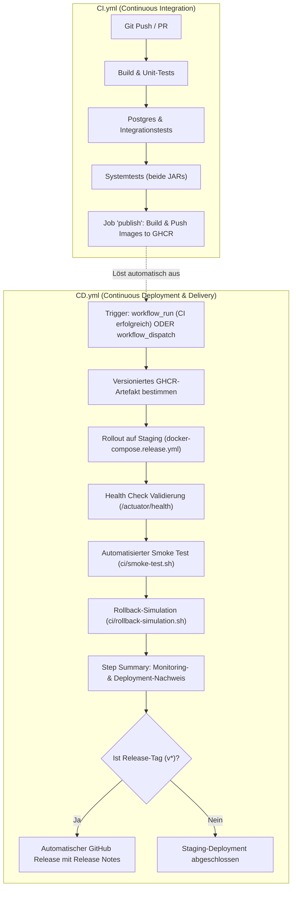

# Dokumentation: P4 – Continuous Deployment & Delivery

**Projektname:** Ticket_System  
**Modul + Gruppe:** M324_Gruppe_4  
**Auftrag:** P4 – Continuous Deployment  

---

## Ziel des Dokuments
In diesem Dokument beschreiben wir die Erweiterung unserer DevOps-Prozesse um **Continuous Delivery (CD)** und **Continuous Deployment (CD)** für das Ticket-System. Aufbauend auf der Test-Pipeline aus [P3](P3_CI_Variantenvergleich.md) und den versionierten Container-Artefakten aus [P3b](P3b_Artifakt_Repository.md) wird der gesamte Release- und Auslieferungsprozess automatisiert.

Das Dokument umfasst:
1. Den Vergleich und die Bewertung mehrerer Bereitstellungs- und Deployment-Ansätze
2. Die Begründung der gewählten Architektur und Plattform-Entscheidung
3. Die Definition und strikte Abgrenzung der Umgebungen (Dev, QA/Staging, Production)
4. Den sicheren Umgang mit Konfigurationen und Secrets (12-Factor App)
5. Den lückenlosen Nachweis der verwendeten versionierten Artefakte
6. Die Pipeline-Architektur mit Trennung von `CI.yml` und `CD.yml`
7. Rollout-Strategien, Skalierung und Ausfallsicherheit (inkl. Kubernetes & Blue/Green Setup)
8. Die Validierung mittels Spring Boot Actuator Health Checks, Docker Healthchecks und automatisierten Smoke Tests
9. Die Rollback-Strategie inklusive praktischer Verifikation / Simulation
10. Eine Analyse der offenen Risiken und Gegenmassnahmen
11. Den Nachweis des vollen Lehrperson-Zugriffs

---

## 1. Vergleich der Bereitstellungs- und Deployment-Ansätze

Gemäss den Anforderungen haben wir mehrere grundlegende Ansätze für die Bereitstellung und Auslieferung unseres Microservice-Systems analysiert:

### Die Ansätze im Detail

1. **Direktes Kompilieren & Installation auf Server (Bare-Metal / VM mit systemd)**
   - *Prinzip:* Der Sourcecode oder das JAR wird direkt auf die Zielmaschine übertragen. Java 21 und PostgreSQL sind als Systemdienste vorinstalliert. Ein systemd-Service verwaltet den Lebenszyklus des Java-Prozesses.
   - *Vorteile:* Kein Container-Overhead, sehr transparentes OS-Monitoring.
   - *Nachteile:* Starke Umgebungsabhängigkeit ("Works on my machine"-Problem), mühsame Updates von Java-Versionen, fehlende Isolation zwischen den Microservices, schwierige Skalierung.

2. **Einzelne Container (`docker run`)**
   - *Prinzip:* Die Anwendung läuft in Docker-Containern, wird aber manuell oder über einfache Shell-Skripte mit `docker run` gestartet.
   - *Vorteile:* Gute Isolation, reproduzierbare Laufzeitumgebung.
   - *Nachteile:* Vernetzung, Volumes und Abhängigkeiten (z. B. PostgreSQL vor Microservice starten) müssen manuell geskriptet werden. Fehleranfällig und schlecht wartbar.

3. **Container-Composition (`docker compose`)**
   - *Prinzip:* Deklarative Definition aller Services, Netzwerke, Volumes und Health Checks in einer YAML-Datei (`docker-compose.release.yml`).
   - *Vorteile:* Sehr einfache Handhabung, deklarative Health Checks (`depends_on: condition: service_healthy`), identische Ausführung lokal und auf CI/CD-Runnern, keine Lizenz- oder Cloud-Kosten.
   - *Nachteile:* Standardmässig auf einen einzelnen Host beschränkt; kein automatisches Cross-Node-Load-Balancing ohne Zusatztools.

4. **Container-Orchestrierung mit Docker Swarm**
   - *Prinzip:* Integriertes Clustering von Docker mit Service-Deklaration, Routing Mesh und Rolling Updates über mehrere Server hinweg.
   - *Vorteile:* Geringere Einstiegshürde als Kubernetes, Rolling Updates nativ unterstützt.
   - *Nachteile:* In der Industrie weitgehend durch Kubernetes verdrängt, schrumpfendes Ökosystem.

5. **Kubernetes (K8s / K3s / AWS EKS)**
   - *Prinzip:* Der Industriestandard für Container-Orchestrierung. Verwaltet Pods, Services, Ingress, Deployments, Rolling Updates und Horizontal Pod Autoscaling (HPA) über Nodes hinweg.
   - *Vorteile:* Maximale Skalierbarkeit, Ausfallsicherheit durch Selbstheilung (Self-Healing), native Rolling Updates ohne Downtime, feingranulares Secret-Management.
   - *Nachteile:* Hohe Komplexität und Konfigurationsaufwand, ressourcenintensiv für ein kleines Projekt.

6. **Cloud-Native Serverless CaaS (AWS ECS mit AWS Fargate)**
   - *Prinzip:* Container-Ausführung ohne Server-Verwaltung in AWS. Anbindung an Application Load Balancer (ALB), AWS Secrets Manager und RDS PostgreSQL.
   - *Vorteile:* Keine Serverwartung, elastische Skalierung, tiefe Integration in AWS IAM und CloudWatch.
   - *Nachteile:* Bindung an einen Cloud-Provider (Vendor Lock-in), laufende Cloud-Kosten, zwingend AWS-Konto und Credentials für die Ausführung nötig.

---

### Vergleichsmatrix

| Kriterium | Bare-Metal / VM | Einzelne Container | Docker Compose | Docker Swarm | Kubernetes (K8s) | AWS Fargate |
|---|---|---|---|---|---|---|
| **Komplexität** | Gering | Gering bis mittel | **Gering (optimal)** | Mittel | Hoch | Mittel bis hoch |
| **Isolierung & Portabilität** | Gering | Hoch | **Sehr hoch** | Sehr hoch | Sehr hoch | Sehr hoch |
| **Microservice-Orchestrierung** | Manuell | Mühsam (Bash) | **Deklarativ & elegant** | Deklarativ | Deklarativ (mächtig) | Deklarativ (AWS Task Def) |
| **Horizontale Skalierung** | Aufwendig | Manuell | Eingeschränkt (`--scale`) | Nativ | **Hervorragend (HPA)** | Sehr gut (Autoscaling) |
| **Zero-Downtime Rollout** | Kaum machbar | Schwer | Mit Blue/Green & Nginx | Nativ (Rolling) | **Nativ (Rolling / Blue-Green)** | Nativ (Rolling / Blue-Green) |
| **Ressourcenbedarf & Kosten** | Niedrig | Niedrig | **Sehr niedrig (0 CHF)** | Niedrig | Hoch | Pay-per-Use (Cloud-Kosten) |
| **Automatisierbarkeit in CI/CD** | Mittel | Mittel | **Sehr hoch (GitHub Runner)** | Hoch | Hoch | Hoch |
| **Zugriff für Lehrperson** | Eingeschränkt | Eingeschränkt | **100% garantiert** | Eingeschränkt | Benötigt K8s-Cluster | Benötigt AWS-Zugang |

---

## 2. Plattform-Entscheidung & Begründung

### Gewählte Primärlösung für CI/CD: Docker Compose Release (Staging-Automatisierung)
Für die vollautomatische CD-Pipeline in GitHub Actions setzen wir primär auf **Docker Compose mit den publizierten GHCR-Images** ([`docker-compose.release.yml`](../Code/Ticket_System/docker-compose.release.yml)):

1. **Garantierter Lehrperson-Zugriff:** Jeder GitHub Actions Runner (`ubuntu-latest`) kann Docker Compose sofort ohne externe Cloud-Accounts, VPC-Konfigurationen oder Secrets ausführen.
2. **Build once, deploy many:** Die Pipeline bezieht exakt die in P3b gebauten und getesteten Images aus der GitHub Container Registry (`ghcr.io/yaracorder0/m324_gruppe4/...`).
3. **Echtes Systemverhalten:** Durch Docker Healthchecks auf Spring Boot Actuator (`/actuator/health`) starten die Services deterministisch in der richtigen Reihenfolge (Postgres -> Employee-Service -> Ticket-Service).
4. **Reproduzierbarkeit:** Jedes Gruppenmitglied und die Lehrperson können dieselbe Staging-Umgebung mit einem einzigen Befehl lokal oder auf einem Server starten:
   ```bash
   IMAGE_TAG=1.0.0 docker compose -f Code/Ticket_System/docker-compose.release.yml up -d
   ```

### Konzeptioneller Alternativ-Ansatz: Kubernetes & Cloud-Skalierung (m346 / m347)
Als alternativen Ansatz haben wir das Gelernte aus den Modulen **m346 (Cloud)** und **m347 (Dienste mit Containern)** analysiert und eine Bereitstellung in einem Kubernetes-Cluster (z. B. AWS EKS) konzipiert:
- **Zero-Downtime Rollout:** Ein Kubernetes `Deployment` mit `RollingUpdate`-Strategie (`maxUnavailable: 0`, `maxSurge: 1`) stellt sicher, dass alte Pods erst beendet werden, wenn neue Pods über Readiness-Probes (`/actuator/health`) gesunden Zustand melden.
- **Horizontale Autoskalierung:** Mittels `HorizontalPodAutoscaler` (HPA) können die zustandslosen Microservice-Pods bei steigender Last (z. B. CPU > 75%) dynamisch von 2 auf bis zu 5 Instanzen hochskaliert werden.
- **Ingress & Load Balancing:** Ein Ingress-Controller (bzw. AWS Application Load Balancer ALB) übernimmt SSL-Termination und das Routing auf `/api/employees` und `/api/tickets`.
- **Fazit:** Dieser Ansatz ist ideal für stark frequentierte Produktivsysteme mit Hochverfügbarkeitsanforderung. Für unsere automatisierte CI/CD-Pipeline und die Bewertbarkeit durch die Lehrperson ist Docker Compose jedoch die pragmatischere und verlässlichere Wahl, da sie ohne fremde Cloud-Kosten oder Zugangsdaten sofort auf jedem Runner durchläuft.

---

## 3. Definition und Abgrenzung der Umgebungen

Für eine verlässliche Automatisierung unterscheiden wir klar zwischen **Development**, **QA / Staging** und **Production**:

| Eigenschaft | Development (Dev) | QA / Staging (Abnahme) | Production (Prod) |
|---|---|---|---|
| **Zweck** | Schnelle Entwicklung, lokales Debugging, Ausführen von Unit- & Integrationstests | Automatisierte Systemtests, Smoke Tests, Validierung des Release-Kandidaten | Echter Anwendungsbetrieb für Endbenutzer |
| **Host / Plattform** | Lokale Entwickler-Laptops (Docker Desktop) | GitHub Actions Runner / Staging-Server (`docker-compose.release.yml`) | Kubernetes Cluster (EKS/K8s) oder AWS Fargate |
| **Artefakt-Quelle** | Lokaler Build (`mvn package`, lokale Dockerfiles) | **Nur publizierte GHCR-Images** mit Commit-SHA (`sha-xxxx`) oder Release-Tag | **Nur freigegebene GHCR-Images** mit SemVer-Tag (z. B. `1.0.0`) |
| **Datenbestand** | Lokale PostgreSQL mit Test-Seeds (`init-scripts/init.sql`) | Isoliertes PostgreSQL mit standardisierten Abnahme-Daten | Produktive PostgreSQL mit persistentem Storage (PVC / AWS RDS) |
| **Trigger / Branch** | Jeder lokale Entwicklungsstand, Feature-Branches (`feature/**`) | **Vollautomatisch** nach erfolgreicher CI auf `main` oder bei Release-Tags | **Freigabebasiert** (Manual Approval / Git-Tag `v*`) |
| **Logging & Actuator** | `DEBUG`-Level, vollständige Stacktraces, alle Actuator-Details offen | `INFO`-Level, Actuator Health aktiv für automatische Smoke Tests | `WARN`/`ERROR`-Level, Actuator-Endpunkte nur intern/abgesichert |
| **Netzwerk & Ports** | Ports 8081, 8082, 5433 direkt auf `localhost` gemappt | Container im isolierten Docker-Netzwerk, Ports für Smoke Test gebunden | Nur Port 80/443 über Ingress/Load Balancer erreichbar |

---

## 4. Konfigurations- und Secret-Handling (Sicherheit)

Wir halten uns strikt an die Grundsätze der **12-Factor App (Faktor III: Config)**: Code und Konfiguration sind vollständig getrennt.

### Trennung von Code und Konfiguration
- **Keine Passwörter oder Geheimnisse im Quellcode:** Weder in `pom.xml`, Java-Klassen noch in Dockerfiles stehen produktive Zugangsdaten.
- **Spring Boot Externalized Configuration:** Die Microservices verwenden in `application.properties` neutrale Standardwerte für die lokale Entwicklung, die zur Laufzeit prioritär über Umgebungsvariablen überschrieben werden:

| Variable | Beschreibung | Standard (Dev) | Staging / Produktion |
|---|---|---|---|
| `SPRING_DATASOURCE_URL` | JDBC-Verbindungs-URL | `jdbc:postgresql://localhost:5433/...` | `jdbc:postgresql://postgres:5432/...` |
| `SPRING_DATASOURCE_USERNAME` | Datenbank-Benutzer | `ticket_user` | Aus Secret / Umgebungsvariable |
| `SPRING_DATASOURCE_PASSWORD` | Datenbank-Passwort | `ticket_password` | Aus Secret / Umgebungsvariable |
| `EMPLOYEE_SERVICE_URL` | Inter-Service-Kommunikation | `http://localhost:8081/api/employees` | `http://employee-service:8081/api/employees` |

### Secret-Handling in den Umgebungen
1. **Entwicklung (Dev):** Unkritische Dummy-Passwörter in lokalen Containern. Lokale Konfigurationen via `.gitignore` geschützt.
2. **CI/CD & Staging:**
   - Authentifizierung an der GitHub Container Registry über das flüchtige, automatisch generierte `${{ secrets.GITHUB_TOKEN }}`.
   - Least Privilege: Lese- und Schreibrechte werden in der Pipeline nur dort vergeben, wo sie zwingend gebraucht werden (`packages: write` nur beim Publish).
3. **Produktion:**
   - In Kubernetes: Auslagerung in `kind: Secret` (`postgres-secret`), welches als Umgebungsvariable in den Pod injiziert wird ([`01-postgres.yaml`](../Code/Ticket_System/k8s/01-postgres.yaml)).
   - In AWS: Verwaltung über den **AWS Secrets Manager** oder **AWS Systems Manager Parameter Store**.
4. **Schutz sensibler Endpunkte:**
   - `/actuator/health` liefert nur den aggregierten Status (`UP`/`DOWN`). Details zur Datenbankstruktur werden nicht unauthentifiziert nach aussen gegeben.
5. **Passwort-Sicherheit:**
   - Wie in [T4](../Theorie/T4_Theorie_Continuous_Deployment.md#wie-werden-passwörter-sicher-gespeichert) dargelegt, werden Passwörter ausschliesslich mit **BCrypt** und individuellen Salts gehasht.

---

## 5. Nachweis der versionierten Artefakte

Gemäss dem Leitsatz **"Build once, deploy many"** wird der Code während des Deployments **nicht neu kompiliert oder neu gebaut**. Stattdessen wird exakt das in der CI-Stufe [P3b](P3b_Artifakt_Repository.md) gebaute und in der GitHub Container Registry (GHCR) abgelegte Docker-Image bezogen.

### Eindeutige Identifikation des Artefakts

```
ghcr.io/<owner>/m324_gruppe4/<service>:<tag>
```

- **Staging-Deployment auf `main`:** Verwendet das Tag `sha-<commit>` (z. B. `sha-4a2b91c`), das unveränderlich an den Git-Commit gebunden ist.
- **Produktions-/Release-Deployment:** Verwendet das Semantic Versioning Tag (z. B. `1.0.0`), das durch den Git-Tag `v1.0.0` ausgelöst wurde.
- **Image Digest:** Jedes Image besitzt einen kryptografischen SHA-256 Digest (z. B. `sha256:d89f...`), der Manipulationen ausschliesst.

### Artefakt-Bezug
```bash
# Beziehen des versionierten Artefakts ohne Build
docker pull ghcr.io/yaracorder0/m324_gruppe4/employee-service:sha-4a2b91c
docker pull ghcr.io/yaracorder0/m324_gruppe4/ticket-service:sha-4a2b91c
```

---

## 6. Pipeline-Architektur: Trennung von CI und CD

Auf Basis unseres Architektur-Reviews haben wir uns bewusst für eine **saubere Trennung in zwei Pipelines** entschieden:
- [`.github/workflows/CI.yml`](../.github/workflows/CI.yml): Continuous Integration & Artefakt-Publishing
- [`.github/workflows/CD.yml`](../.github/workflows/CD.yml): Continuous Deployment & Delivery

### Zusammenspiel der Workflows



### Trigger-Konfiguration in `CD.yml`
1. **`workflow_run`:** Startet vollautomatisch, wenn der Workflow `CI (V2)` auf dem Branch `main` mit Status `success` abschliesst.
2. **`workflow_dispatch`:** Ermöglicht den manuellen Start durch Entwickler oder die Lehrperson mit individueller Parameterauswahl:
   - `image_tag`: Angabe des gewünschten Version-Tags (auch für gezielte Rollbacks auf frühere Versionen)
   - `environment`: Wahl zwischen `staging` und `production`
   - `simulate_rollback`: Optionale Ausführung der Rollback-Prüfung

---

## 7. Rollout-Konzepte, Skalierung & Ausfallsicherheit

### Rollout-Strategien im Vergleich

| Strategie | Ablauf | Downtime | Ressourcen | Geeignet für |
|---|---|---|---|---|
| **Recreate** | Alte Container stoppen -> Neue Container starten | Gering (ca. 5–15s) | Minimal (1x) | Dev, Staging, kleinere interne Tools |
| **Rolling Update** | Instanzen werden sukzessive einzeln ersetzt | **Zero Downtime** | Moderat (+1 Instanz) | Kubernetes, Standard-Produktion |
| **Blue/Green** | Parallele Umgebung (Green) hochfahren, testen, Traffic per Load Balancer umleiten | **Zero Downtime** | Hoch (2x Infrastruktur) | Kritische Produktivsysteme, Instant Rollback |
| **Canary** | 5–10% des Verkehrs auf neue Version leiten, Metriken überwachen, dann steigern | **Zero Downtime** | Flexibel | Sehr grosse Cloud-Plattformen mit vielen Nutzern |

### Bewertung der Rollout-Strategien für unser Projekt

1. **Gewählte Implementierung für Staging (CI/CD):** **Recreate mit Health Check Verifikation**
   - Die Staging-Umgebung nutzt `docker-compose.release.yml`. Der Container-Tausch dauert nur wenige Sekunden. Nach dem Start blockiert der Workflow, bis die Actuator Health Checks beider Services `UP` melden. Anschliessend validiert der Smoke Test die Funktionsfähigkeit. Da Staging eine Test- und Abnahmeumgebung ist, ist die minimale Downtime von wenigen Sekunden vernachlässigbar und die Konfiguration extrem schlank.
2. **Evaluierter Ansatz für Produktion: Zero-Downtime Rolling Update**
   - In einer Kubernetes- oder Cloud-Umgebung (z. B. AWS ECS/EKS) würden wir auf `RollingUpdate` setzen. Dabei werden neue Container hochgefahren und erst nach bestandenem Health Check in den Load Balancer aufgenommen, bevor die alten Container heruntergefahren werden.
3. **Evaluierter Ansatz: Blue/Green Deployment**
   - Zwei identische Umgebungen (Blue = aktiv, Green = inaktiv) hinter einem Load Balancer (z. B. Nginx oder AWS ALB). Bietet den schnellsten Rollback durch sofortiges Zurückschalten des Datenverkehrs, verdoppelt jedoch die Infrastrukturkosten für die Zeit des parallelen Betriebs.

### Skalierbarkeit und Ausfallsicherheit (Architektur-Analyse)
- **Stateless Microservices:** Weder `employee-service` noch `ticket-service` halten lokalen Sitzungszustand im Speicher. Beide können horizontal auf $N$ Instanzen skaliert werden:
  - Docker Compose: `docker compose up --scale ticket-service=3`
  - Kubernetes: Automatische Skalierung via **Horizontal Pod Autoscaler (HPA)** zwischen 2 und 5 Pods basierend auf CPU-Auslastung (> 75%).
- **Stateful Database:** PostgreSQL ist zustandsbehaftet. In Kubernetes sichern wir dies über ein `PersistentVolumeClaim` (PVC) ab. Im Cloud-Betrieb (AWS) wird dies über einen Managed Service wie **Amazon RDS** mit Multi-AZ-Replikation realisiert.

---

## 8. Validierung: Smoke Tests, Health Checks & Monitoring

Ein Deployment gilt erst dann als erfolgreich, wenn automatische Prüfungen die Funktionsfähigkeit nachweisen.

### 1. Spring Boot Actuator Health Checks
Beide Microservices stellen den standardisierten Endpunkt `/actuator/health` bereit. Dieser prüft:
- Ob der Java-Prozess lebt (Liveness)
- Ob die Verbindung zur PostgreSQL-Datenbank aktiv und ansprechbar ist (Readiness)

**Rückgabe bei gesunder Verbindung (HTTP 200):**
```json
{
  "status": "UP",
  "components": {
    "db": {
      "status": "UP",
      "details": {
        "database": "PostgreSQL",
        "validationQuery": "isValid()"
      }
    },
    "diskSpace": {
      "status": "UP"
    },
    "ping": {
      "status": "UP"
    }
  }
}
```

### 2. Docker Compose Health Checks
In [`docker-compose.release.yml`](../Code/Ticket_System/docker-compose.release.yml) führen die Container zyklische Health Checks durch:
```yaml
healthcheck:
  test: ["CMD-SHELL", "wget -qO- http://localhost:8081/actuator/health | grep -q '\"status\":\"UP\"' || exit 1"]
  interval: 5s
  timeout: 3s
  retries: 25
  start_period: 15s
```
Dadurch startet der `ticket-service` erst, wenn sowohl die Datenbank als auch der `employee-service` nachweislich `healthy` sind.

### 3. Automatisierter Smoke Test ([`ci/smoke-test.sh`](../Code/Ticket_System/ci/smoke-test.sh))
Nach dem Rollout führt die Pipeline den Smoke Test aus:
- **Schritt 1:** Abfrage der Health-Status beider Services
- **Schritt 2:** Anlage und Abruf eines Test-Mitarbeiters via `POST /api/employees` und `GET /api/employees/{id}`
- **Schritt 3:** Anlage und Abruf eines Tickets via `POST /api/tickets` unter Referenzierung des neuen Mitarbeiters (Verifikation der Inter-Service-Kommunikation!)
- **Schritt 4:** Erfolgsmeldung (Exit-Code 0) oder Abbruch mit Fehlercode 1 bei fehlerhafter Antwort.

Für lokale Windows-Tests steht das äquivalente PowerShell-Skript [`ci/smoke-test.ps1`](../Code/Ticket_System/ci/smoke-test.ps1) zur Verfügung.

### 4. Monitoring-Nachweis in der Pipeline
Die CD-Pipeline schreibt nach jedem Lauf einen zusammenfassenden Bericht direkt in das **GitHub Step Summary**:
- Name und Digest des deployten Artefakts
- Live-Ausgabe des `/actuator/health`-Endpunkts
- Tabellarischer Container-Status (`docker compose ps`)
- Auszug der letzten Container-Logs zur Fehler- und Leistungsdiagnose

---

## 9. Rollback-Strategie & Nachweis der praktischen Prüfung

Trotz aller Tests kann es im Live-Betrieb zu unvorhergesehenen Fehlern kommen (z. B. fehlerhafte Umgebungsvariablen, Deadlocks oder unentdeckte Regressionen). Ein automatisierter Notfallplan ist unverzichtbar.

### Rollback-Konzept
1. **Erkennung:** Der Post-Deployment Smoke Test oder der Actuator Health Check schlägt fehl.
2. **Alarmierung:** Die Pipeline bricht den Rollout sofort ab und markiert das Deployment als fehlgeschlagen.
3. **Automatisches Re-Deployment:** Die Pipeline startet automatisch den vorherigen stabilen Image-Tag (`IMAGE_TAG_PREVIOUS`, z. B. `1.0.0` oder der vorherige Commit-SHA).
4. **Validierung:** Der Smoke Test läuft erneut gegen die wiederhergestellte Version.

### Herausforderung Datenbank & Multi-Step Migration
Wie in unserer Theoriearbeit ([T4](../Theorie/T4_Theorie_Continuous_Deployment.md#was-stellt-die-grösste-herausforderung-bei-einem-rollback-dar)) festgehalten, ist die Datenbank das grösste Risiko bei Rollbacks:
- Wenn Version 2 eine Spalte löscht und ein Rollback auf Version 1 erfolgt, stürzt Version 1 ab.
- **Lösung (Expand and Contract Pattern):**
  1. *Expand:* Neue Spalten/Tabellen werden hinzugefügt (nullable oder mit Default-Werten). Alte Felder bleiben bestehen.
  2. *Parallel Run:* Die neue Softwareversion schreibt in beide Strukturen. Ein Rollback auf die Vorversion ist jederzeit verlustfrei möglich.
  3. *Contract:* Erst wenn Version 2 über längere Zeit stabil in Produktion läuft, werden alte Felder in einer separaten Migration bereinigt.

### Praktischer Nachweis: Rollback-Simulation ([`ci/rollback-simulation.sh`](../Code/Ticket_System/ci/rollback-simulation.sh))
Um die Funktionsfähigkeit der Rollback-Strategie zu beweisen, ist in der Pipeline ein automatisierter Simulationstest integriert:
1. Das Skript simuliert ein fehlerhaftes Release (nicht erreichbare Ports / defekte Konfiguration).
2. Der Smoke Test schlägt planmässig fehl und fängt den Fehler ab.
3. Der Rollback-Mechanismus greift automatisch, stoppt die fehlerhafte Instanz und re-deployt das stabile Tag.
4. Das System bestätigt die erfolgreiche Wiederherstellung mit `CD ROLLBACK VALIDATION: PASSED`.

---

## 10. Restrisiken und Gegenmassnahmen

| Identifiziertes Restrisiko | Auswirkung | Gegenmassnahme im Projekt |
|---|---|---|
| **Fehlerhafte Datenbankmigration** | Rollback der Anwendung schlägt fehl, weil DB-Schema inkompatibel ist | Strikte Einhaltung des Expand-and-Contract-Musters; automatische Backups vor Schema-Updates |
| **Silent Failures / Nicht abgedeckte Edge-Cases** | Smoke Test prüft nur Happy Path; tieferliegende Business-Logic-Fehler bleiben unentdeckt | Vollständige Systemtest-Suite in der CI vor dem Deployment; Alerting auf HTTP 5xx-Fehlerraten |
| **Ausfall der Container Registry (GHCR)** | Neue Deployments können Images nicht pullen | Registry Caching auf Runnern; Multi-Region Fallback-Registry in Enterprise-Umgebungen |
| **Secret-Leakage in Logdateien** | Sensible Passwörter tauchen in Pipeline-Logs auf | Automatische Maskierung durch GitHub Secrets; keine Ausgabe von Umgebungsvariablen im Klartext |
| **Ressourcen-Engpässe auf dem Zielhost** | Container stürzen wegen Out-of-Memory (OOM) ab | Ressourcen-Limits (CPU & Memory) in Docker Compose und Kubernetes konfiguriert |

---

## 11. Lehrperson-Zugriff & Vollständige Reproduzierbarkeit

Die Vorgabe *"Die Lehrperson muss vollen Zugriff auf Ihre Pipelines und Prozesse haben und diese ausführen können"* wird wie folgt sichergestellt:

1. **Keine proprietären Cloud-Sperren:** Die primäre CD-Pipeline läuft vollständig auf den standardmässigen GitHub Actions Runnern (`ubuntu-latest`). Es werden keine privaten AWS-Zugangsdaten der Gruppenmitglieder benötigt, um die CD-Prozesse zu testen.
2. **Öffentliche Artefakte:** Die in P3b eingerichteten GHCR-Packages sind öffentlich lesbar:
   - `ghcr.io/yaracorder0/m324_gruppe4/employee-service`
   - `ghcr.io/yaracorder0/m324_gruppe4/ticket-service`
3. **Manueller Start via `workflow_dispatch`:** Die Lehrperson kann im GitHub-Reiter **Actions** auf **`CD (Continuous Deployment & Delivery)`** klicken, auf **Run workflow** drücken und das Deployment mit beliebigem Image-Tag ausführen.
4. **Lokale Reproduzierbarkeit:** Mit einem einzigen Befehl kann die Lehrperson die Staging-Umgebung lokal starten:
   ```bash
   cd Code/Ticket_System
   docker compose -f docker-compose.release.yml up -d
   bash ci/smoke-test.sh
   ```

---

## 12. KI-Einsatz

Die KI wurde gemäss den Vorgaben als Architektur- und Deployment-Reviewer eingesetzt. Die Details der Diskussion (z. B. Variantenvergleich, Trennung von `CI.yml` und `CD.yml`, Actuator-Integration und Rollback-Design) sind im [KI-Nachweis](KI_Nachweis.md#p4-continuous-deployment) dokumentiert.
