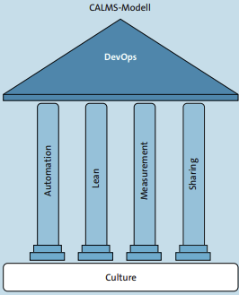
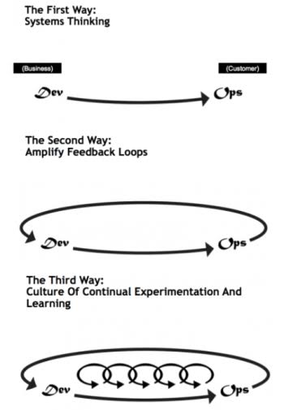

# DevOps Kultur - CALMS & The Three Ways

## Inhalt 
- [Neue Begriffe](#Neue-Begriffe)
- [CALMS](#CALMS)
- [The Three Ways](#The-Three-Ways)
- [Vergleich](#Vergleich)
- [Bewertung der Transformation](#Bewertung-der-Transformation)

## Neue Begriffe
#### *Entwicklungszyklen*
- Phase, die ein Feature von der Anforderung über Development und Testing bis zur Produktion durchläuft
#### *Silos*
- Organisatorische Abgrenzung zwischen Entwicklung und Betrieb
#### *Lead Time*
- Gesamtzeit vom Erstellen eines Tickets bis zum Deployment in Produktion
#### *Processing Time*
- Netto arbeitszeit an einem Ticket, ohne Wartezeiten auf Reviews oder Testing
#### *MTTR (Mean Time to Repair)*
- Durchschnittliche Zeit von einem aufgetretenen Fehler bis zur Behebung
#### *Deployment-Frequenz*
- Häufigkeit, mit der neue Software Releases erfolgreich in Produktion deployed werden

## CALMS Prinzipien
***CALMS*** - Culture Automation Lean Measurement Sharing
 

### C - Culture (Kultur)
- Zusammenarbeit zwischen Entwicklern (Dev) und Betreiber (Ops), anstatt Silos
- Gemeinsame Verantwortung übernehmen, für Qualität, Betrieb und schnellen Releases
- Keine Schuldzuweisung (No Blame Culture), sondern Fehler werden analysiert und behoben
- Management, Entwicklung und Betrieb verfolgen dieselben Ziele
- Kultur wird durch Workshops und Teambuilding verändert

### A - Automation (Automatisierung)
- Wiederholende Aufgaben werden automatisiert: Tests, Builds, Deployments und Monitoring
- CI/CD Pipeline werden eingeführt
- Automatisierung beschleunigt Prozesse, reduziert Fehler

### L - Lean (Schlankheit)
- Unnötige Prozesse und Arbeiten vermeiden 
- Fokus auf kontinuierliche Verbesserung und Kundennutzen
- Experimente ermöglichen, schnelleres Feedback zu sammeln, um daraus zu lernen
- Nutzung von Kanban-Boards, zur Reduktion von Durchlaufszeiten/WIP's 

### M - Measurement (Messung)
- Entscheidungen basieren auf Messungen und Feedback
- Typische Metriken sind MTTR (Mean Time to Repair), Lead und Processing Time
- Unterscheidung zwischen Prozess-, Betriebs- und Business-Metriken
- Messung zeigt Schwachstellen und macht auch Erfolge sichtbarer

### S - Sharing (Wissenfluss)
- Wissen, Erfahrungen und Fehler werden offen geteilt
- Fördert Lernen innerhalb und zwischen Team 
- Schafft Vertrauen und offene Fehlerkultur
- Ziel ist, die Organisation soll aus Fehler lernen und Doppelarbeit vermeiden
- Etablierung von einem zentralen Wiki, interne Lernformate und regelmässiger Erfahrungsberichte

### Fazit
Das CALMS-Modell bietet eine klare Struktur, um die Kernelementen von DevOps zu verstehen.
Sie dient als ein Orientierungsrahmen, ersetzt aber keine Erfolgsmessung

---

## The Three Ways

### 1. System Thinking/Flow
- Fokus auf das gesamte System (anstatt Silos) und das Vermeiden von lokalen optimierungen
- Reibungsloses Zusammenarbeiten/Flow zwischen Entwicklern, Betreiber und letztendlich dem Kunden
- Arbeiten werden sichtbar gemacht und Engpässe (Bottlenecks) identifiziert und behoben, Übergaben werden minimiert
- Entwicklungszyklen werden gemessen und optimiert (anstatt 6 monatige Releases, zu wochentlichen)
- Einsetzung von Kanban-Board, um die Arbeit zu visualisieren

### 2. Amplify Feedback Loop
- Feedback sollte schnell, kontinuierlich und automatisiert erfolgen (MTTR)
- Probleme werden sofort erkannt und behoben, um Qualität zu sichern
- Ermöglicht schnelle Reaktion auf Kundenwunsch und minimiert Ausfallzeiten (Wöchentliche Releases)

### 3. Continual Learning and Experimentation
- Wissen wird nicht gehortet, sondern stetig geteilt und im Projekt verankert
- Fehler werden schuldlos analysiert (No Blame-Culture), um Verbesserungen zu teilen
- Etablierung von Feedback-Loops und Wissensteilung, durch Workshops, Teambuilding und Erfahungsberichten

## Vergleich

| Gemeinsame Idee                   | CALMS-Bezug                                                                                                                            | Bezug zu The Three Ways                                                                                                    | Beispiel aus  Fallbeispiel                                                                                                                  | Eigene Einschätzung                                                                                                                          |
| :-------------------------------- | :------------------------------------------------------------------------------------------------------------------------------------- | :------------------------------------------------------------------------------------------------------------------------- | :------------------------------------------------------------------------------------------------------------------------------------------ | :------------------------------------------------------------------------------------------------------------------------------------------- |
| **Kulturwandel & Vertrauen**      | **Culture:** Zusammenarbeit zwischen Dev & Ops, gemeinsame Verantwortung (No Blame Culture)                                            | **3. Way:** Continual Learning & Experimentation (Lernen aus Fehlern & Experimente ermöglichen)                            | Kulturveränderung durch Workshops und Teambuilding, sowohl schuldfreie Fehleranalyse                                                        | Kultur bildet die Basis von guter Arbeit, mehr Vertrauen und angstfreie Arbeit ermöglicht schnellere Analysen und Releases                   |
| **Fluss & Effizienz**             | **Automation & Lean:** Wiederkehrende Aufgaben automatisieren (Tests, Builds, CI/CD)  unnötige Prozesse und Verschwendung vermeiden | **1. Way:** Systems Thinking/Flow (Gesamtsystem im Überblick, Übergaben minimieren, Arbeit mit Kanban-Board visualisieren) | Umstellung von 6 monatigen auf wöchentliche Releases, Einsatz von CI/CD Pipelines und Kanban-Boards                                         | Automatisierung erleichert arbeit und reduziert manuelle Fehler. Dadurch ensteht einen klaren Fluss und mehr Verständnis                  |
| **Schnelle Rückmeldung & Daten**  | **Measurement:** Entscheidungen auf Basis von Daten, Prozess- und Betriebs-Metriken treffen                                            | **2. Way:** Amplify Feedback Loops (schnelles, kontinuierliches und automatisierten Feedback)                              | Evaluierung von Metriken wie MTTR (Mean Time to Repair), Lead Time und Processing Time, welche zur Optimierung der Entwicklungszyklen hilft | Gemessene Prozesse können verbessert werden. Schnelles Feedback ermöglicht kürzere Ausfallzeiten, und schnellere Reaktion auf Kundenanfragen |
| **Wissenstransfer & Transparenz** | **Sharing:** Wissen, Erfahrungen und Fehler offen im und zwischen den Teams teilen                                                     | **3. Way:** Continual Learning & Experimentation (Wissen im Projekt verankern und nicht horten)                            | Etablierung von Wissensteilung und Austausch durch Erfahrungsberichte, Teambuilding und Workshops                                           | Gemeinsame Dokumentation und Wissensaustausch verhindert Doppelarbeit. Es verbessert sowohl auch Qualität der Arbeit im ganzen Projekt       |

## Bewertung der Transformation

Meiner Meinung nach hatten diese zwei Veränderungen bei TechNova den grössten Nutzen:

1. Automatisierung (CI/CD-Pipeline)
- Bezug zu CALMS: Automation
- Bezug zu The Three Ways: 1. Weg (Systems Thinking / Flow)
- Begründung: Die manuelle Arbeit bei Tests und Deployments hat früher sehr viel Zeit gekostet und viele Fehler verursacht. Durch die CI/CD-Pipeline wurde der ganze Ablauf automatisch und viel schneller. Erst dadurch konnte TechNova von 6 monatigen Releases auf wöchentliche Releases wechseln.

2. Kulturwandel (No-Blame-Culture & Teambuilding)
- Bezug zu CALMS: Culture und Sharing
- Bezug zu The Three Ways: 2. Way (Feedback Loops) und 3. Way (Continual Learning)
- Begründung: Neue Tools bringen nichts, wenn Dev und Ops gegeneinander arbeiten oder Fehler verschweigen. Durch die Workshops und die No Blame Culture haben die Teams gelernt, zusammenzuarbeiten und aus Fehlern zu lernen, anstatt sich gegenseitig die Schuld zu geben.

## Transfer 

In meinem Betrieb müsste vor allem das **CALMS-Element: Sharing** und der **3. Weg aus The Three Ways (Continual Learning and Experimentation)** verbessert werden.

Das Thema *Sharing* wird bei uns zwar oft angesprochen und es werden auch Dokumentationen geschrieben, aber im Alltag wird das Wissen fast nicht richtig geteilt. Die Entwickler arbeiten meistens eher für sich alleine.

Das hängt auch direkt mit dem *3. Weg (Continual Learning and Experimentation)* zusammen: Im Projektalltag fehlen einfach die Zeit und das Budget für gemeinsame Workshops, den Austausch über Fehler oder das Ausprobieren von neuen Wegen. Im eigenen Interesse des Betriebs sollte das aber mehr Bedeutung bekommen, damit wir als Team voneinander lernen und Fehler nicht doppelt machen.

---

## KI-Nachweis

- Prompt: "Kannst du den Transfer noch etwas natürlicher an meinen eigenen Schreibstil anpassen und die Begriffe explizit nennen?"
- KI-Hinweis: Die KI hat die beiden geforderten Begriffe (Sharing & 3. Weg) direkt im Satz eingebunden und den Text noch direkter in meinen eigenen Worten formuliert.
- Korrigierte Stelle: Abschnitte "Transfer" und "KI-Nachweis".
- Eigene Schlussfolgerung: Der Abschnitt klingt jetzt komplett nach mir und erfüllt trotzdem alle Vorgaben der Lehrperson.