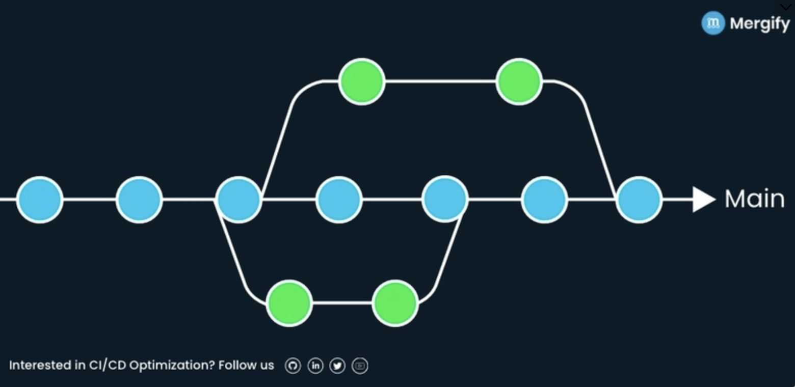
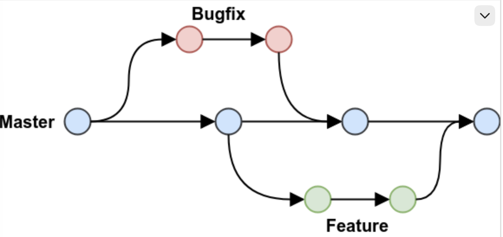
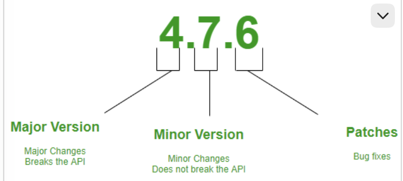
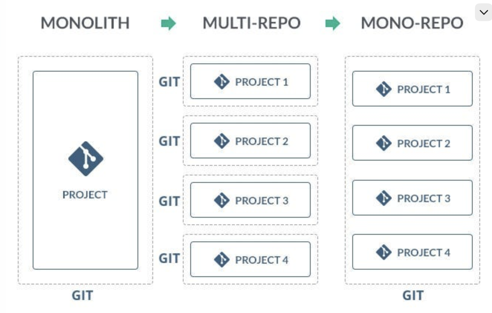

# T3_Theorie_Continuous_Integration

## Themen

### 1. Was ist Continuous Integration (CI) und wie wird es umgesetzt?

**Quellen:** GitLab – What is CI/CD? – https://about.gitlab.com/topics/ci-cd/ | Fowler – Continuous Integration – https://martinfowler.com/articles/continuousIntegration.html

- **Welche Bedeutung hat Continuous Integration im Softwareentwicklungsprozess?**
  - Continuous Integration wird genutzt, um alle Codeänderungen frühzeitig und häufig in den Main-Branch eines gemeinsamen Repository zu integrieren, jede Änderung automatisch bei der Übertragung oder Zusammenführung zu testen und einen neuen Build zu starten. Wörtlich beschreibt GitLab das so: CI ist "the practice of integrating all your code changes into the main branch of a shared source code repository early and often, automatically testing each change when you commit or merge them, and automatically kicking off a build" [GitLab]. Dieser Prozess hilft, Codekonflikte bei der Zusammenarbeit zu minimieren. Martin Fowler ergänzt die zeitliche Komponente noch etwas genauer: Jedes Teammitglied sollte "at least daily" mit den anderen zusammenführen [Fowler] – also nicht nur "häufig", sondern konkret mindestens einmal pro Tag.
- **Welche technischen Prozesse und Werkzeuge ermöglichen eine erfolgreiche Implementierung von CI?**
  - Entwicklungsteams können durch CI/CD-Pipelines automatisierte Prozesse für die Softwareentwicklung erstellen, um zuverlässige Updates bereitstellen zu können. Hier werden verschiedene Arten von Tests innerhalb der CI/CD-Pipeline durchgeführt, dazu gehören Unit-Tests, Integrationstests und Regressionstests. Technisch braucht es dafür eine Versionskontrolle (Git), ein Build-Tool (bei uns Maven) und einen CI-Server, der bei jedem Push automatisch baut und testet (bei uns GitHub Actions).
- **Welche Rolle spielt CI in der Automatisierung und Zusammenarbeit in Teams?**
  - CI spielt eine entscheidende Rolle in der Zusammenarbeit in Teams, da die Automatisierung von Builds und Tests sicherstellt, dass Fehler frühzeitig erkannt und behoben werden können, was die Qualität der Software erhält. GitLab betont zusätzlich, dass häufiges Mergen und automatisches Testen Codekonflikte minimieren und Fehler behoben werden können, während die Arbeit noch frisch im Kopf ist [GitLab].

**Bezug zu P3:** Unser README nennt CI bereits als Ziel ("bei jedem Pull Request automatisch gebaut, getestet"). Für P3 heisst das konkret: einen GitHub-Actions-Workflow für den Maven-Reactor-Build (ticket-service + employee-service) einrichten und diesen Check als Required Status Check auf main hinterlegen.

*Update (Stand heute):* Der Workflow ist mittlerweile umgesetzt (`.github/workflows/CI.yml`) — er baut und testet beide Services im Maven-Reactor, inklusive Integrationstests gegen eine containerisierte PostgreSQL-Instanz und anschliessenden Systemtests.

---

### 2. Was sind die Vor- und Nachteile von CI?

**Quellen:** Atlassian – Continuous Integration vs. Delivery vs. Deployment – https://www.atlassian.com/continuous-delivery/principles/continuous-integration-vs-delivery-vs-deployment | Fowler – Continuous Integration – https://martinfowler.com/articles/continuousIntegration.html

- **Welche Vorteile bringt die Einführung von CI für die Softwareentwicklung?**
  - Die Einführung von CI in die Softwareentwicklung führt generell zu schnelleren Entwicklungszyklen, da das automatisierte Testen die Stabilität der Applikation gewährleistet und somit keine unerwarteten Integrationsprobleme beim eventuellen Mergen entstehen. Fowler nennt als Kernnutzen zusätzlich, dass CI es überhaupt erst ermöglicht, sicher zu refactoren, weil Fehler sofort durch die Tests auffallen würden [Fowler].
- **Welche Herausforderungen können bei der Implementierung und im Betrieb von CI auftreten?**
  - Entwickler müssen für alle Features, Updates und Bug Fixes automatisierte Tests schreiben.
  - Entwickler müssen die Änderungen so oft wie möglich mergen, mindestens einmal am Tag – das ist bei Fowler eine der zentralen CI-Praktiken ("Everyone Pushes Commits To the Mainline Every Day" [Fowler]), erfordert aber Disziplin im Team und funktioniert nur, wenn der Build entsprechend schnell und zuverlässig ist.
- **Wie beeinflusst CI langfristig die Produktqualität und den Workflow in einem Team?**
  - Weniger Bugs gelangen in Production, da die automatisierten Tests diese bereits früh erkennen. Tests sind somit auch günstiger, da sie automatisiert und nicht einzeln manuell durchgeführt werden müssen.

**Bezug zu P3:** Aktuell hat unser Projekt nur einen einzigen Test (TicketSystemApplicationTests.contextLoads()), der keine echte Fachlogik prüft. Der grösste Nachteil für uns ist also nicht CI an sich, sondern dass eine grüne Pipeline ohne echte Tests wenig Aussagekraft hat.

*Update:* Inzwischen gibt es bereits mehrere Testklassen mit echter Fachlogik statt nur `contextLoads()` — u. a. `TicketServiceTest`, `TicketControllerTest`, `TicketIntegrationTest` und `EmployeeServiceTest` mit Unit- und Integrationstests (Mockito, Statuswechsel-Logik).

---

### 3. Was ist Continuous Testing, und wie wird es umgesetzt?

**Quelle:** IBM – What is Continuous Testing? – https://www.ibm.com/think/topics/continuous-testing

- **Wie unterscheidet sich Continuous Testing von traditionellen Testmethoden?**
  - Die herkömmliche Methode, in jeder Phase der Entwicklung manuell Feedback einzuholen, führt zu ineffizienter Nutzung der Unternehmensressourcen und zu längeren Integrationszyklen. Durch Continuous Testing mit dem "Shift-Left"-Ansatz werden Tests schon früher im SDLC (Software Development Life Cycle) priorisiert – IBM beschreibt das als Automatisierung, die manuelle Prüfschritte weitgehend ersetzt [IBM].
- **Welche Rolle spielt Continuous Testing im Entwicklungszyklus?**
  - Während des gesamten Entwicklungszyklus werden kontinuierlich automatisierte Tests durchgeführt und durch Continuous Integration im Code jeweils validiert. Laut IBM laufen bei jedem neuen Commit automatisch vordefinierte Testskripte, die das Team sofort benachrichtigen, wenn ein Test fehlschlägt [IBM].
- **Welche Arten von Tests werden dabei typischerweise automatisiert, und wie wird ihre Effektivität sichergestellt?**
  - Integrationstests – helfen, fehlende Abhängigkeiten zu finden.
  - Funktionstests – überprüfen, ob das Benutzererlebnis den Erwartungen entspricht, zum Beispiel ob ein User über Tickets benachrichtigt wird.
  - Regressionstests (nichtfunktional) – prüfen, ob sich Leistung, Funktionalität oder Abhängigkeiten ändern, nachdem ein Fehler behoben wurde, und ob das System wie zuvor noch funktioniert. IBM nennt daneben auch Unit- und Performance-Tests sowie User-Acceptance-Tests als typische automatisierte Testarten [IBM].

**Bezug zu P3:** Für P3 sollten wir gezielt zuerst Unit-Tests für die Kernlogik (z. B. Ticket-Statuswechsel) schreiben, danach Integrationstests der Repositories gegen die containerisierte PostgreSQL-Instanz.

*Update:* Die geplanten Unit-Tests für die Kernlogik (Ticket-Statuswechsel) und die Integrationstests der Repositories gegen PostgreSQL sind bereits vorhanden.

---

### 4. Was ist eine Branching-Strategie, und welches sind die bekanntesten Ansätze?

**Quellen:** dev.to – Git Branching Strategies: A Comprehensive Guide – https://dev.to/karmpatel/git-branching-strategies-a-comprehensive-guide-24kh | trunkbaseddevelopment.com – https://trunkbaseddevelopment.com/ | DORA – Trunk-Based Development Capability – https://dora.dev/capabilities/trunk-based-development/

Eine Branching-Strategie ist die Vorgehensweise, wie Teams in einem Repository zusammenarbeiten. Hier gibt es verschiedene Ansätze:

**Trunk Based Development**

- Im Trunk-Based Development entwickeln Entwickler:innen direkt in einem einzigen Branch (Trunk, meist main), um lange Feature-Branches zu vermeiden. Kurze Feature-Branches (üblicherweise 1–2 Tage) werden dann in main gemergt. Trunkbaseddevelopment.com definiert das als Modell, "where developers collaborate on code in a single branch called 'trunk'" [trunkbaseddevelopment.com].
- DORA quantifiziert das sogar mit konkreten Werten für hohe Performance: "three or fewer active branches" im Repository und "merge branches to trunk at least once a day" [DORA].
- Gut für Continuous Integration, wenige Merge-Konflikte, kleine inkrementelle Changes – erfordert dafür aber laut dev.to "sophisticated testing" und den Einsatz von Feature Toggles [dev.to].

**GitHub Flow**

- Ist ein branch-basierter Workflow von GitHub, um durch Pull Requests schnell zu agieren und in main zu mergen. Er ist "simpler than GitFlow and designed for teams practicing continuous delivery" [dev.to], hat dafür aber laut dev.to keine klare Staging- oder Integrationstestphase eingebaut und ist schlechter geeignet, wenn mehrere Versionen parallel unterstützt werden müssen.

- *Nehmen Sie spziell den trunk based Ansatz in den Vergleich auf.*

- **Warum sind Branching-Strategien für die Versionskontrolle wichtig?**
  - Branching-Strategien sind für die Versionskontrolle wichtig, da sie durch strukturierte und aufgeteilte Arbeit eine klare Historie erschaffen, damit alle Beteiligten nachverfolgen können, was passiert ist, und nichts Unerwartetes passiert.
- **Wie beeinflussen unterschiedliche Strategien die Code-Organisation und den Arbeitsfluss in Teams?**
  - Verschiedene Branching-Strategien haben verschiedene Stärken und Schwächen. Bei GitHub Flow liegt der Fokus zum Beispiel mehr auf Continuous Delivery durch die Konzentration auf den main-Branch. Es kommt stark auf die Arbeitsweise im Team selbst an, welche Branching-Strategie optimal wäre.
- **Welche Branching-Strategien werden häufig verwendet, und worin unterscheiden sie sich?**
  - Git Flow, GitHub Flow und Trunk-Based Development – sie unterscheiden sich vor allem in der Anzahl langlebiger Branches und wie schnell integriert wird (siehe oben).

**Bezug zu P3:** Wir arbeiten laut P1-Dokumentation bereits mit feature/*-Branches, die per Pull Request gegen main gemergt werden – das entspricht GitHub Flow. Für P3 lohnt es sich, die Branch-Laufzeit bewusst kurz zu halten (im Sinne von Trunk-Based Development), damit CI wirklich täglich integrieren kann.

---

### 5. Wie kann man Commits und Branches mit User Stories verknüpfen?

**Quellen:** GitHub Docs – Linking a pull request to an issue – https://docs.github.com/en/issues/tracking-your-work-with-issues/linking-a-pull-request-to-an-issue | Atlassian – Process issues with Smart Commits – https://support.atlassian.com/jira-software-cloud/docs/process-issues-with-smart-commits/ | EU Component Library – Git Conventions – https://ec.europa.eu/component-library/v1.15.0/eu/docs/conventions/git/

- **Warum ist es sinnvoll, Codeänderungen mit User Stories zu verknüpfen?**
  - Damit können Entwickler in einem dedizierten Branch isoliert arbeiten, effektiv kollaborieren und einfache Code-Reviews ermöglichen. Zusätzlich – und das ist eigentlich der wichtigste Grund – bleibt so nachvollziehbar, welcher Code zu welcher Anforderung gehört, ohne dass man später im Commit-Verlauf raten muss.
- **Welche Praktiken und Namenskonventionen können helfen, diese Verknüpfung effektiv umzusetzen?**
  - Bei Commits jeweils die gleichen Präfixe benutzen, z. B. feat:, fix:, docs:, style:, refactor:, perf:, test:, chore: – die EU-Konvention definiert diese Typen genauso und verlangt zusätzlich, dass im Footer eines Commits auf das zugehörige Issue verwiesen wird, das dieser Commit schliesst [EU Component Library].
  - GitHub erkennt dafür konkrete Schlüsselwörter in Commit- oder PR-Beschreibungen (Closes #10, Fixes #10, Resolves #10), die ein Issue automatisch schliessen, sobald der PR in den Default-Branch gemergt wird [GitHub Docs].
  - Jira verwendet dafür sogenannte Smart Commits direkt in der Commit-Nachricht, z. B. JRA-34 #comment corrected indent issue oder JRA-090 #close [Atlassian].
- **Wie unterstützen Tools die Verbindung zwischen Aufgabenmanagement und Code-Repositories?**
  - GitHub Issues verknüpft Branches automatisch mit dem Issue, aus dem sie erstellt wurden, und schliesst Issues automatisch bei Merge in main. Jira verknüpft Commits über den Issue-Key direkt im Ticket als "Development"-Information. Beides ist die eigentliche Antwort auf diese Frage – reine Merge-Werkzeuge wie git merge verknüpfen dagegen nichts mit dem Aufgabenmanagement, das ist nicht ihre Aufgabe.

**Bezug zu P3:** Wir nutzen bereits ein GitHub Issue Board. Für P3 sollten wir konsequent Closes #<Issue-Nummer> in jede Pull-Request-Beschreibung schreiben und Branches nach dem Schema feature/<Issue-Nr>-kurzbeschreibung benennen.

---

### 6. Welche Merge-Strategien gibt es, und wann werden sie verwendet?

**Quelle:** Pro Git – Git Branching: Rebasing – https://git-scm.com/book/en/v2/Git-Branching-Rebasing

- **Welche Ansätze gibt es, um Änderungen aus einem Branch in einen anderen zu integrieren?**
  - Rebase: Beim Rebasen werden die Commits des aktuellen Branches genommen und am Ende des Zielbranches neu angehängt. Somit entsteht eine lineare Historie ohne zusätzliche Merge-Commits, das Log lässt sich einfacher lesen. Der Nachteil dabei ist, dass die Commits neu geschrieben werden und dadurch neue Hashes erhalten.
  - Merge: Beim Merge werden die Änderungen direkt zu einem neuen Commit (Merge-Commit) zusammengeführt. Die ursprüngliche Historie bleibt unverändert, und der Merge-Commit zeigt, wie die Zweige wieder integriert wurden. Das kann bei vielen Zweigen aber schnell unübersichtlich werden.
- **Wie beeinflussen unterschiedliche Merge-Strategien die Historie und die Nachvollziehbarkeit von Änderungen?**
  - Da beim Rebasen die alten Commits durch neue, ähnliche Commits mit neuen Hashes ersetzt werden, kann es zu Verwirrung in der Historie kommen, falls diese Commits bereits von anderen gepusht/gepullt wurden – nicht zu einem Sicherheitsproblem, sondern zu doppelten, schwer nachvollziehbaren Commits bei allen, die bereits mit dem alten Stand weiterarbeiteten. Git selbst formuliert das als "goldene Regel": "Do not rebase commits that exist outside your repository and that people may have based work on" [Pro Git]. Beim Merge bleiben alte Commits dagegen unverändert und somit originalgetreu.
- **Unter welchen Umständen wird welche Strategie bevorzugt?**
  - Bei Projekten mit mehreren Entwicklern ist es sinnvoll, Merge zu verwenden, da die Historie für andere Entwickler nachvollziehbarer und klarer bleibt.
  - Rebase ist sinnvoll für lokale, noch nicht gepushte Commits, um die eigene Historie vor dem Teilen aufzuräumen – nicht für bereits öffentlich geteilte Branches (siehe goldene Regel oben).

**Bezug zu P3:** Für unser kleines Team empfehlen wir Squash-and-Merge für Feature-Branches, damit die Historie auf main übersichtlich bleibt, während im Feature-Branch selbst frei committet werden darf.

---

### 7. Was ist Semantic Versioning, und wie wird es eingesetzt?

**Quellen:** mindtwo – Semantic Versioning (SemVer) – https://www.mindtwo.de/blog/semantic-versioning-semver | semver.org 2.0.0 – https://semver.org/

- **Wie hilft Semantic Versioning bei der Verwaltung von Software-Versionen?**
  - SemVer hilft, die Versionierung standardisiert und auch für weitere Entwickler klar zu halten. Hier wird das Schema MAJOR.MINOR.PATCH verwendet. Die offizielle Spezifikation begründet das mit dem Problem der "dependency hell", bei dem Projekte entweder nicht mehr upgraden können oder von zu optimistischer Kompatibilität ausgehen [semver.org].
- **Welche Konventionen werden bei Semantic Versioning angewendet?**
  - MAJOR für Breaking Changes (nicht abwärtskompatibel), MINOR für neue Funktionen (abwärtskompatibel), PATCH für Bugfixes oder weitere kleinere Änderungen. Ein Wechsel von z. B. 2.4.3 auf 3.0.0 signalisiert damit klar, dass etwas kaputtgehen könnte [mindtwo].
- **Warum ist Semantic Versioning wichtig für die Kompatibilität und Kommunikation von Änderungen?**
  - Klarheit und Kommunikation gegenüber Entwicklern und Nutzern, z. B. ob es potenziell zerstörerische Änderungen gibt.
  - Kompatibilität sichern – solange die Major-Version gleich bleibt, sollte ein Update keine unerwarteten Probleme verursachen [mindtwo].
  - Abhängigkeiten verwalten, z. B. über Versionsbereiche wie ^2.3.1.

**Bezug zu P3/P3b:** Unsere pom.xml steht aktuell bei 0.0.1-SNAPSHOT. Sobald die Services eine erste stabile REST-Schnittstelle haben, sollten wir auf 0.1.0 wechseln und Docker-Images entsprechend taggen statt latest zu verwenden.

---

### 8. Welchen Unterschied haben Mono- und Multirepo-Ansätze im Kontext von Microservices?

**Quellen:** Potvin & Levenberg (2016) – Why Google Stores Billions of Lines of Code in a Single Repository, ACM – https://research.google/pubs/why-google-stores-billions-of-lines-of-code-in-a-single-repository/ | Fowler – Microservices – https://martinfowler.com/articles/microservices.html

- **Wie unterscheiden sich Mono- und Multirepo-Ansätze in der Organisation von Code?**
  - Bei Monorepos arbeiten Entwickler über das gleiche Repository.
  - Bei Multirepos arbeiten Entwickler jeweils an den einzelnen Repositories, für die sie zuständig sind.
- **Welche Vor- und Nachteile haben beide Ansätze speziell für die Entwicklung und Wartung von Microservices?**
  - Bei Monorepos hat man alle Abhängigkeiten im gleichen Repo, wodurch sich Schnittstellenänderungen sofort im ganzen Build zeigen. Google nennt das als Kernvorteil: eine gemeinsame "source of truth" und vereinfachtes Abhängigkeitsmanagement, weil es nur eine Version jeder internen Bibliothek gibt [Potvin & Levenberg]. Wichtig zur Einordnung: Das bedeutet nicht, dass automatisch keine Breaking Changes mehr passieren – es bedeutet nur, dass sie sofort beim gemeinsamen Build auffallen statt erst später bei einem anderen Team. Der Nachteil ist, dass bei kleineren Änderungen oft alle Microservices neu gebaut und getestet werden, was ohne Pfadfilter in der CI mehrere Stunden dauern kann.
  - Bei Multirepos hat jeder Microservice sein komplett eigenes Git-Repo, eigene CI/CD-Pipelines und oft auch dedizierte Teams – das entspricht genau dem Prinzip der unabhängigen Deploybarkeit, das Fowler als Kernidee von Microservices beschreibt: "you only need to redeploy the service(s) you modified" [Fowler]. Der Nachteil hier ist, dass dies zu einer Art Abhängigkeitshölle führen kann: Wenn eine geteilte Bibliothek aktualisiert wird, muss für jeden Microservice ein eigener Pull Request erstellt, getestet und gemergt werden, um die neue Version einzuspielen. Das erfordert höhere Disziplin im Team.
- **Wie beeinflussen die Ansätze die Skalierbarkeit, Zusammenarbeit und Abhängigkeiten zwischen Teams?**
  - Bei Monorepos sind die technischen Hürden für die Skalierung grösser, da jede Person die gesamte Historie erhält, obwohl nicht alles für sie relevant ist. Das führt zu höherer Komplexität und mehr Abstimmungsbedarf, da alle den gleichen Codestand sehen und sich daran halten sollten. Google löst das laut Potvin & Levenberg nur durch massive eigene Tooling-Investitionen (eigenes Build-System, eigenes virtuelles Dateisystem) [Potvin & Levenberg].
  - Bei Multirepos ist die technische Skalierung einfacher, da der Code auf kleinere Repos verteilt ist und neue Services schneller hinzugefügt werden können. Teams arbeiten autonomer und können ihre Prozesse, Review-Richtlinien und ihren Rhythmus selbst bestimmen, ohne Rücksicht auf andere Teams.

**Bezug zu P3b:** Unser Projekt ist seit dem Split in ticket-service/employee-service faktisch ein Monorepo mit Maven-Multi-Modul-Reactor. Für unsere Projektgrösse ist das sinnvoll; bei weiterem Wachstum würden wir Pfadfilter in der CI-Pipeline einführen, statt komplett auf Multirepo zu wechseln.

---

### 9. Was ist ein Artifact-Repository, und welche Aufgaben erfüllt es?

**Quellen:** JFrog – What is a Software Artifacts Repository? – https://jfrog.com/learn/devops/software-artifact-repository/ | GitHub Docs – Introduction to GitHub Packages – https://docs.github.com/en/packages/learn-github-packages/introduction-to-github-packages

- **Welche Rolle spielt ein Artifact-Repository in der Softwareentwicklung und im Bereitstellungsprozess?**
  - Ein Artifact-Repository ist der zentrale, versionierte Speicherort, in dem das fertige, aus einer CI/CD-Pipeline gebaute und getestete Artefakt abgelegt wird – nicht das Artefakt selbst, sondern der Ort, an dem es gespeichert, versioniert und für ein Deployment auf einem Server oder für weitere Teams abrufbar gemacht wird [JFrog].
- **Welche Arten von Artefakten werden typischerweise in einem Repository verwaltet?**
  - Anwendungsspezifische Paketformate (Language Packages), z. B. bei der Kompilierung und beim Testing durch Entwickler und CI-Server (bei uns: JARs aus Maven).
  - Container und Infrastruktur (Cloud Native), z. B. Docker-Images, für die Release-Phase der CD-Pipeline. GitHub Packages unterstützt genau das über die integrierte Container Registry, zusätzlich zu Maven-, npm- und NuGet-Paketen [GitHub Docs].
- **Warum ist ein Artifact-Repository wichtig für CI/CD-Pipelines?**
  - Es ist das Fundament für CI/CD-Pipelines, denn ohne dieses zentrale, versionierte Ablegen von Artefakten würde das DevOps-Prinzip "Build once, deploy anywhere" zusammenbrechen: Ohne Artifact-Repository müsste jede Umgebung ihr eigenes Artefakt neu bauen, statt garantiert dasselbe getestete Artefakt zu verwenden.

**Bezug zu P3b:** Für unser Ticket-System bietet sich die GitHub Container Registry (ghcr.io) an, da sie direkt über den GITHUB_TOKEN unserer Actions-Pipeline nutzbar ist, ohne zusätzliche externe Infrastruktur.

*Update:* ghcr.io ist bereits produktiv im Einsatz — der `publish`-Job in der CI-Pipeline baut und pusht Docker-Images für beide Services dorthin (bei Push auf main bzw. bei Release-Tags).

---

## Quellen (Übersicht)

1. GitLab. What is CI/CD? https://about.gitlab.com/topics/ci-cd/
2. Fowler, M. Continuous Integration. https://martinfowler.com/articles/continuousIntegration.html
3. Atlassian. Continuous Integration vs. Delivery vs. Deployment. https://www.atlassian.com/continuous-delivery/principles/continuous-integration-vs-delivery-vs-deployment
4. IBM. What is Continuous Testing? https://www.ibm.com/think/topics/continuous-testing
5. dev.to (Karm Patel). Git Branching Strategies: A Comprehensive Guide. https://dev.to/karmpatel/git-branching-strategies-a-comprehensive-guide-24kh
6. trunkbaseddevelopment.com. Trunk Based Development. https://trunkbaseddevelopment.com/
7. DORA / Google Cloud. Trunk-Based Development Capability. https://dora.dev/capabilities/trunk-based-development/
8. GitHub Docs. Linking a pull request to an issue. https://docs.github.com/en/issues/tracking-your-work-with-issues/linking-a-pull-request-to-an-issue
9. Atlassian Support. Process issues with Smart Commits. https://support.atlassian.com/jira-software-cloud/docs/process-issues-with-smart-commits/
10. European Commission Component Library. Git Conventions. https://ec.europa.eu/component-library/v1.15.0/eu/docs/conventions/git/
11. Chacon, S. & Straub, B. Pro Git – Git Branching: Rebasing. https://git-scm.com/book/en/v2/Git-Branching-Rebasing
12. mindtwo. Semantic Versioning (SemVer). https://www.mindtwo.de/blog/semantic-versioning-semver
13. Preston-Werner, T. Semantic Versioning 2.0.0. https://semver.org/
14. Potvin, R. & Levenberg, J. (2016). Why Google Stores Billions of Lines of Code in a Single Repository. Communications of the ACM, 59(7), 78–87. https://research.google/pubs/why-google-stores-billions-of-lines-of-code-in-a-single-repository/
15. Fowler, M. Microservices. https://martinfowler.com/articles/microservices.html
16. JFrog. What is a Software Artifacts Repository? https://jfrog.com/learn/devops/software-artifact-repository/
17. GitHub Docs. Introduction to GitHub Packages. https://docs.github.com/en/packages/learn-github-packages/introduction-to-github-packages

---

## KI Recherche & Kontrolle

Die Recherche und die Antworten stammen von mir. Die Quellen wurden anschliessend nochmals durch Claude Code überprüft und stellenweise ergänzt. Die Updates zum Bezug zum Stand für P3 wurden durch Claude verifiziert.
