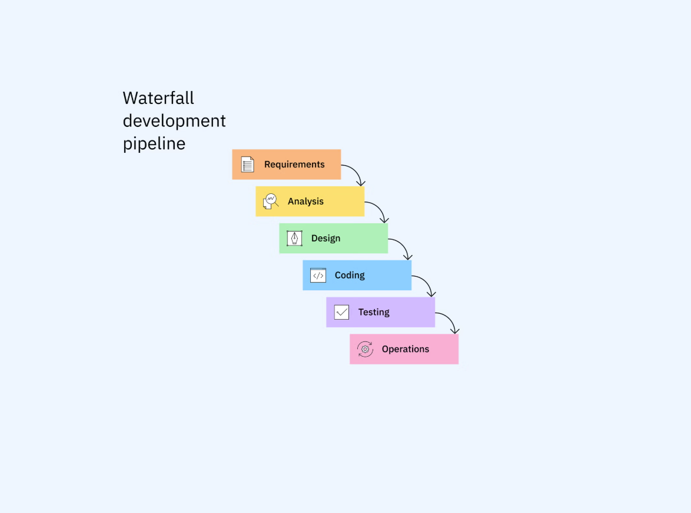
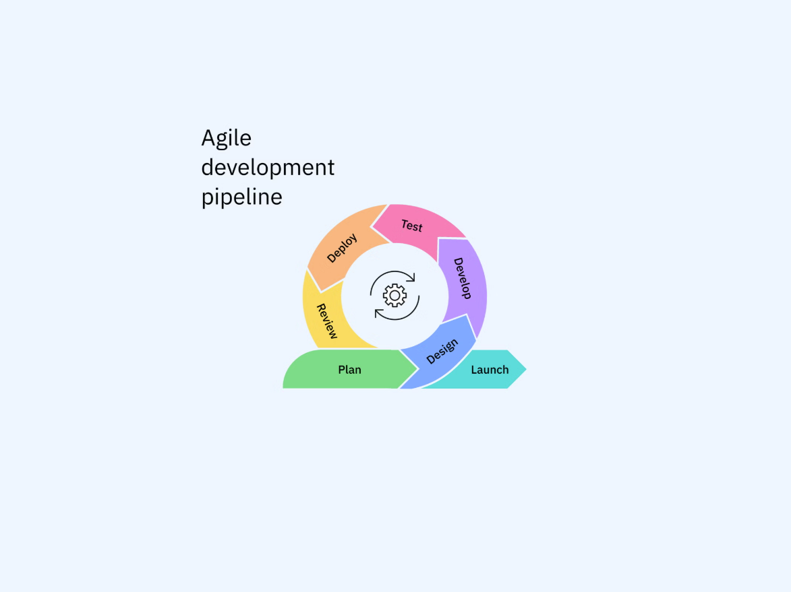
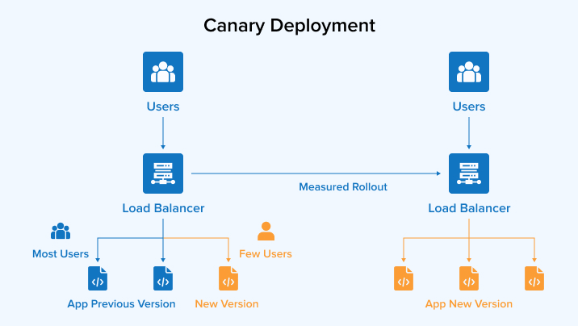
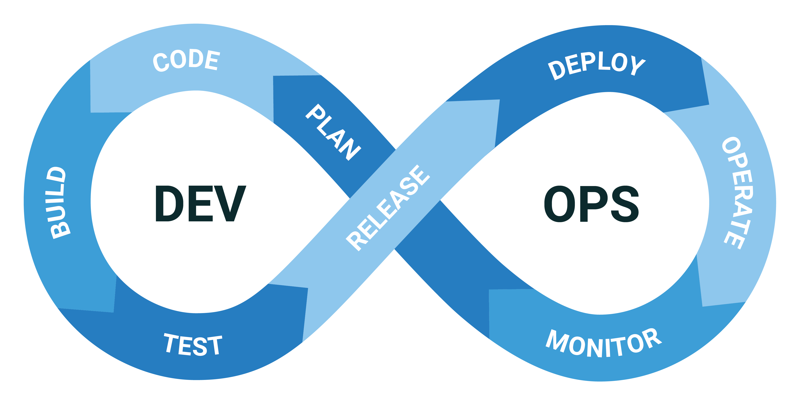
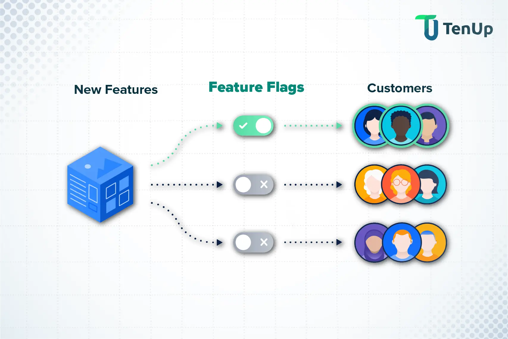

# T4_Theorie_Continuous_Deployment

## Was ist Continuous Deployment und wie wird es umgesetzt?

Continuous Deployment bedeutet, dass jede Codeänderung, 
die alle automatisierten Tests besteht, automatisch in die Produktionsumgebung deployed wird, ohne 
dass man den Release manuell triggern muss, wie bei Continuous Delivery. 
Das System entscheidet selbst, ob ein Release live gehen darf.

### Wie wird Continuous Deployment umgesetzt?

Damit Continuous Deployment (kurz CD) funktioniert, braucht es eine komplett automatisierte Pipeline. 
Der Ablauf sieht normalerweise so aus:

1. **Vollständige Testautomatisierung (CI)**
    - Jeder Commit ins Repository löst automatisch einen Build aus.
    - Unit-Tests, Integrationstests, End-to-End-Tests, Systemtests und Sicherheits-Scans laufen automatisch durch.
    - Die Testabdeckung muss hoch sein, weil niemand den Code vor dem Release manuell prüft.
   
   <br>
   
2. **Automatisierte Build- und Artefaktverwaltung**
   - Nach bestandenen Tests baut die Pipeline ein unveränderliches Artefakt wie z. B. ein Docker-Image.
   - Das Image wird mit einer eindeutigen Version versehen und in eine Container-Registry wie z. B. Docker Hub oder GitHub Container Registry hochgeladen.

   <br>
   
3. **Infrastruktur und automatisches Deployment**
    - Das neue Artefakt wird automatisch auf die Produktionsumgebung ausgerollt.
    - Tools wie GitHub Actions, GitLab CI/CD oder ArgoCD übernehmen das Deployment.
    - Es gibt keinen manuellen Knopf mehr, sondern es läuft alles vollautomatisch.

    <br>
   
4. **Zero-Downtime Deployment-Strategien**
    - Um Ausfallzeiten für Nutzer zu vermeiden, werden Strategien wie Blue/Green Deployment eingesetzt.
    - Dabei bleiben die alten Instanzen so lange aktiv, bis die neuen Instanzen vollständig bereit sind.
    - So kann jederzeit zwischen alter und neuer Version gewechselt werden, ohne dass Nutzer etwas davon merken.

    <br>
   
5. **Automatisierte Health-Checks, Smoke-Tests und Monitoring**
    - Nach dem Deployment prüft das System automatisch, ob die Anwendung korrekt läuft (z. B. API-Endpoints, Datenbankverbindungen, Health-Status).
    - Smoke-Tests stellen sicher, dass die wichtigsten Funktionen erreichbar sind.
    - Monitoring-Tools wie Prometheus oder Grafana überwachen Fehlerraten, Latenzen und Systemzustand in Echtzeit.
    - Wenn Probleme auftreten, stoppt die Pipeline das Deployment und löst bei Bedarf automatisch ein Rollback aus.

    <br>
   
6. **Automatischer Rollback-Mechanismus**
    - Wenn nach einem Deployment Fehler auftreten (z. B. viele HTTP-500-Statuscodes, hohe Latenz, fehlerhafte Funktionen), reagiert die Pipeline automatisch.
    - Das System schaltet in diesem Fall auf die vorherige, stabile Version zurück, was man einen Rollback nennt.
    - So bleibt die Produktionsumgebung möglichst stabil, auch wenn ein Release schiefgeht.


**Grobe visuelle Darstellung des Ablaufs**



---

## Was ist der Unterschied zwischen Continuous Deployment und Continuous Delivery?

Der Hauptunterschied liegt im allerletzten Schritt, und zwar geht es darum, wer oder was die Software am Ende live schaltet. 
Es kann entweder ein Mensch sein oder eine automatisierte Pipeline.

**Continuous Delivery (Manuelle Freigabe)** <br> 
  - Die Pipeline baut und testet den Code automatisch.  
  - Danach wird die neue Version auf einer Testumgebung (auch Staging genannt) bereitgestellt und wartet dort.  
  - Ein Entwickler muss am Ende die Freigabe manuell erteilen, damit die Änderung auf den echten Live-Server deployed wird.
<br>

**Continuous Deployment (Vollautomatisch)** <br>
- Die Änderung wird nach dem Bestehen aller automatisierten Tests von der Pipeline vollständig automatisch auf den Live-Server deployed.


### Vergleichstabelle

| Thema                | Continuous Delivery                     | Continuous Deployment                                   |
|----------------------|------------------------------------------|----------------------------------------------------------|
| **Go-Live**          | Manuell (per Klick)                      | Vollautomatisch                                          |
| **Kontrolle**        | Man entscheidet selbst, wann ein Feature live geht. | Der Code geht live, sobald alle Tests grün sind.         |
| **Voraussetzung**    | Gute automatisierte Tests.               | Sehr hohe Testqualität & automatisches Rollback.         |
| **Typisch für …**    | Firmen mit festen Release-Tagen oder strengen Vorgaben. | Moderne Web-Apps und SaaS-Tools mit vielen kleinen Updates pro Tag. |


### Wann nutzt man was?

- **Continuous Delivery** eignet sich, wenn man Releases bewusst steuern möchte und klare Freigabeprozesse hat.  
- **Continuous Deployment** wird genutzt, wenn man sehr häufig deployt und eine zuverlässige, vollständig automatisierte Pipeline besitzt.

---

## Was sind die Vor- und Nachteile von Continuous Delivery und Continuous Deployment?

Beide Methoden bringen Vorteile gegenüber traditionellen Software-Releases, unterscheiden sich aber deutlich bei Risikokontrolle, Aufwand und Release-Geschwindigkeit.


### Continuous Delivery (mit manuellem Klick)

Hier läuft alles automatisch bis zur Staging-Umgebung.  
Live geht es aber erst, wenn ein Mensch das Okay gibt.

#### Vorteile
* **Volle Kontrolle:** Man bestimmt selbst, wann ein Release rausgeht.
* **Letzter menschlicher Blick:** Vor dem Go-Live kann jemand noch schnell prüfen, ob alles plausibel aussieht.
* **Sicherer bei Testlücken:** Falls die automatisierten Tests mal etwas übersehen, fällt es beim manuellen Check eher auf.

#### Nachteile
* **Features warten ungenutzt:** Fertige Änderungen liegen oft tagelang auf Staging und kommen nicht vorwärts.
* **Abhängigkeit von Personen:** Wenn die Person für die Freigabe nicht da ist, steht alles still.
* **Grosse Releases:** Weil man seltener deployed, sammelt sich viel Code an. Wenn dann etwas schiefgeht, ist die Fehlersuche mühsamer.

---

### Continuous Deployment (vollautomatisch)

Hier geht jede Änderung direkt live, sobald alle Tests grün sind.

#### Vorteile
* **Extrem schnell:** Änderungen sind oft wenige Minuten nach dem Commit schon live.
* **Schnelle Bugfixes:** Fehler im Live-System können sofort behoben werden.
* **Mini-Releases:** Es wird ständig in kleinen Schritten deployed. Das macht Probleme leichter nachvollziehbar.
* **Kein Release-Aufwand:** Niemand muss manuell deployen.

#### Nachteile
* **Tests müssen perfekt sein:** Wenn ein Fehler durch die Tests rutscht, landet er direkt beim Kunden.
* **Hoher Setup-Aufwand:** Man braucht sehr viele, sehr gute Tests und eine stabile Pipeline.
* **Rollback-Pflicht:** Das System muss Fehler selbst erkennen und automatisch auf die alte Version zurückspringen.
* **Weniger Timing-Kontrolle:** Features gehen live, sobald sie fertig sind – ausser man arbeitet zusätzlich mit Feature Toggles.

---

### Vergleichstabelle

| Frage | Continuous Delivery | Continuous Deployment |
| :--- | :--- | :--- |
| **Wer schaltet live?** | Ein Mensch per Klick | Die Pipeline vollautomatisch |
| **Wann geht es live?** | Wenn man bereit dazu ist | Sofort nach bestandenen Tests |
| **Wie gut müssen Tests sein?** | Gut | Sehr gut bis perfekt |
| **Wann nutzt man das?** | Wenn man den Zeitpunkt selbst steuern will | Wenn man Features extrem schnell ausrollen möchte |

---

## Was sind die folgenden Deployment-Strategien und wie werden sie umgesetzt (Blue/Green Deployment & Canary Deployment)?

### Blue/Green Deployment

Beim Blue/Green Deployment hat man zwei vollständig identische Produktionsumgebungen nebeneinander. Diese werden eben Blue und Green genannt.

- **Blue (Live):** Das ist die aktuelle Version, die von allen Nutzern momentan verwendet wird.
- **Green (Inaktiv/Neu):** Das ist die neue Version, auf die noch niemand Zugriff hat.


### Wie wird es umgesetzt?
1. Die neue Software-Version wird komplett auf der inaktiven Umgebung (Green) installiert und getestet.
2. Wenn alles einwandfrei funktioniert, wird die alte Version auf die neue Version umgestellt (Blue -> Green).
3. Alle neuen Anfragen landen dann auf Green.
4. Blue wird sicherheitshalber im Hintergrund weiterhin laufen gelassen. Falls doch noch etwas Kritisches auf Green entdeckt wird, kann man ganz einfach auf Blue zurückschalten.


**Vorteile**
- Es gibt keine Ausfallzeit (Zero Downtime) und somit merken die Nutzer gar nichts vom Update.
- Wenn etwas schiefgeht, schaltet man einfach sofort wieder auf Blue um.

**Nachteile**
- Die Kosten sind höher, da man doppelt so viel Infrastruktur braucht, weil zwei Systeme parallel laufen müssen.
- Die Datenbank muss so aufgebaut sein, dass alte und neue Versionen gleichzeitig damit arbeiten können.




### Canary Deployment
Canary Deployment bedeutet, dass eine neue Version zuerst nur an einen kleinen Teil der Nutzer ausgeliefert wird, um zu sehen, ob alles stabil läuft.

### Wie wird es umgesetzt?
1. Die neue Version wird auf wenigen Servern oder Containern installiert.
2. Nur ein kleiner Prozentsatz des eingehenden Datenverkehrs wird auf die neue Version umgeleitet.
3. Das Team beobachtet Fehlerquoten und Systemleistung im Monitoring.
4. Wenn alles stabil bleibt, wird der Datenverkehr schrittweise erhöht.
5. Tritt ein Fehler auf, betrifft er nur diesen kleinen Nutzeranteil und der Datenverkehr wird sofort wieder auf die alte Version zurückgeschaltet.

**Vorteile**
- Wenn ein Fehler auftritt, merkt das nur ein kleiner Prozentsatz der Nutzer.
- Die die neue Version wird unter echten Bedingungen und mit echten Nutzerdaten getestet.

**Nachteile**
- Die Überwachung ist aufwendiger, weil man zwei Versionen parallel beobachten muss.
- Fehler können trotzdem live auftreten, auch wenn nur wenige Nutzer betroffen sind.




### Vergleichstabelle

| Kriterium            | Blue/Green Deployment                  | Canary Deployment                               |
|----------------------|----------------------------------------|--------------------------------------------------|
| **Umschaltung**      | Auf einen Schlag (100%)                | Schrittweise (z.B. 5% → 25% → 100%)             |
| **Infrastruktur**    | Hoch (zwei komplette Umgebungen nötig) | Niedrig (nur wenige zusätzliche Instanzen nötig) |
| **Risiko pro Nutzer**| Alle Nutzer erhalten das Update sofort | Nur ein kleiner Teil testet zuerst               |
| **Komplexität**      | Moderat                                | Hoch (genaue Steuerung der Nutzeranfragen nötig) |


## Was ist A/B-Testing?
A/B-Testing ist eine Methode, bei der zwei Versionen (A und B) von etwas verglichen werden. Eine Hälfte der Nutzer sieht Version A, die andere Hälfte Version B. Ein Ziel misst, welche Version besser funktioniert. So treffen Firmen Entscheidungen auf Basis echter Daten statt auf Vermutungen.

### Wie funktioniert A/B-Testing?

- **Variante A (Kontrollgruppe):** Das, was bereits in der Produktion von der Mehrzahl der Nutzer verwendet wird.
- **Variante B (Testgruppe):** Die neue/abgeänderte Version, die von einem kleinen Prozentsatz der Nutzer verwendet wird.



Während des Tests misst ein Analyse-Tool das Nutzerverhalten wie z. B. Klickraten, Conversion Rate usw. Die Variante, die statistisch messbar besser abschneidet, wird am Ende für alle Nutzer übernommen.

### Wie wird es umgesetzt?

1. **Hypothese definieren und Ziel festlegen**
   - Zuerst wird klar definiert, was getestet werden soll und welches Ziel erreicht werden muss, wie z. B., dass das neue Feature 10 % mehr Nutzen aufweist als das aktuelle.

<br>

2. **Feature Toggles/Feature Flags einbauen**
   - Im Code wird das neue Feature nicht fest eingebaut, sondern kann über ein Feature-Toggle an- und abgeschaltet werden.
   - Das System entscheidet beim Laden der Seite dynamisch, ob der Nutzer Variante A oder B zu sehen bekommt.

<br>

3. **Nutzer-Routing und Identifizierung**
   - Über Session-Cookies, User-IDs oder den Router/Load-Balancer werden die Anfragen zufällig aufgeteilt, also z. B. 50/50 oder 80/20.
   - Wichtig ist, dass der Nutzer während der Testphase immer die gleiche Variante sieht, damit die User-Experience nicht gestört wird.

<br>

4. **Event-Tracking einbauen**
   - Die Anwendung sendet Daten an ein Analyse-Tool wie z. B. Google Analytics.
   - Es wird genau gemessen, wer welche Variante gesehen hat und ob das Ziel wie z. B. ein Button-Klick ausgeführt wurde.

<br>

5. **Statistische Auswertung und Rollout**
   - Sobald eine ausreichend grosse Datenmenge gesammelt wurde, wird ausgewertet, ob der Unterschied statistisch signifikant ist.
   - Die Variante, die am besten unter den Nutzern angekommen ist, wird fix im Code eingebaut und für alle Nutzer freigeschaltet. Das Feature-Toggle wird anschliessend ausgebaut/entfernt.


---

## Was sind Feature Toggles?

Feature Toggles, auch Feature-Flags genannt, kann man sich wie Lichtschalter im Code vorstellen. Sie ermöglichen es, bestimmte Funktionen oder Code-Abschnitte in einer Software ein- oder auszusschalten, ohne neuen Code deployen zu müssen.

### Warum nutzt man Feature Toggles?

Feature Toggles werden genutzt, um neue Funktionen im Code bereitzustellen, ohne sie sofort für alle Nutzer sichtbar zu machen. So kann man Features schrittweise aktivieren und sicher testen sowie bei Auftreten von Problemen direkt wieder deaktivieren, ohne dass man alles neu deployen muss.

Dabei werden zwei Dinge voneinander getrennt:
   - **Code Deployment:** Der Code wird technisch auf den Server geladen.
   - **Feature-Release:** Die Funktion wird für den Nutzer freigeschaltet.

Das bedeutet, dass Entwickler ihre unfertige oder neue Funktion bereits in den Hauptcode, also `main`, pushen und live deployen. Das Toggle bleibt ausgeschaltet, sodass der Nutzer nichts davon mitbekommt.




### Wie wird es umgesetzt?

Im einfachsten Fall ist ein Feature-Toggle eine einfache `if/else`-Bedingung im Code, die ihren Wert aus einer Konfigurationsdatei, einer Datenbank oder einem Management-Tool liest.

```java
// Beispiel in Java / Spring Boot
if (featureToggleService.isFeatureActive("NEW_TICKET_DESIGN")) {
    // Zeige das neue Ticket-Design (Variante B)
    renderNewTicketDesign();
} else {
    // Zeige das alte Standard-Design (Variante A)
    renderOldTicketDesign();
}
```
Das Feature-Toggle kann dann z. B. über ein Admin-Panel oder eine API den Wert im laufenden Betrieb in Millisekunden von `false` auf `true` setzen.


**Vorteile**
- Neue Features können im Code sein, ohne sofort sichtbar zu werden.
- Man kann Funktionen schrittweise aktivieren, wie z. B. nur für Tester oder einen Prozentsatz der Nutzer.
- Fehler lassen sich schnell entschärfen, weil man das Feature einfach wieder deaktivieren kann, statt alles neu zu deployen.

**Nachteile**
- Der Code wird komplexer, weil überall Bedingungen für Features stehen.
- Wenn man alte Toggles nicht entfernt, kann das zu Verwirrung führen.
- Mehr Aufwand beim Testen, weil man verschiedene Toggle-Zustände berücksichtigen muss.
- Bei vielen Feature Toggles kann man schnell den Überblick verlieren.

---

## Was sind Rollback-Strategien?

Eine Rollback-Strategie ist ein geplanter Prozess, mit dem man eine Software nach einem fehlerhaften Update schnell wieder auf einen stabilen Zustand zurücksetzt.
Das Ziel ist es, bei kritischen Fehlern im Live-Betrieb die Ausfallzeit (auch Downtime genannt) so gering wie möglich zu halten und den Schaden für die Nutzer zu minimieren.

### Warum braucht man eine Rollback-Strategie?

Trotz automatisierter Test-Pipelines lassen sich Fehler in der Produktion niemals vollständig ausschliessen. 
Das heisst, wenn nach dem Release ein kritischer Bug auftritt (wie z. B. Datenverlust oder sehr langsame Ladezeiten), kann es sein, 
dass das Fixen und erneute Deployen des behobenen Bugs oft zu zeitaufwendig ist. 
Ein Rollback stellt den funktionsfähigen Zustand in wenigen Sekunden wieder her.

### Was sind die gängigsten Rollback-Strategien?

**Re-Deployment eines älteren Container-Images / Builds**
- Es funktioniert so, dass das bisherige Artefakt wie z. B. ein Docker-Image mit dem Tag `v1.2.0` erneut gestartet wird, um das fehlerhafte Image mit der Version `v1.3.0` zu ersetzen.
- Der Vorteil dieses Vorgehens ist, dass es einfach umsetzbar ist, da das alte Image bereits fertig gebaut und getestet in der Container-Registry liegt.

**Traffic-Switching (Blue/Green und Canary)**
- Es funktioniert so: Wenn beim Blue/Green- oder Canary-Deployment ein Fehler festgestellt wird, schaltet der Load-Balancer den Datenverkehr vollständig auf die alte, noch laufende Version zurück.
- Der Vorteil dieses Vorgehens ist, dass es fast verzögerungsfrei ist, also ein Zero-Downtime-Rollback.

**Feature-Deaktivierung via Feature-Toggle**
- Es funktioniert so: Wenn der Fehler nur in einem einzigen Feature festgestellt wurde, wird die Funktionalität einfach über einen Konfigurationsschalter deaktiviert.
- Der Vorteil dieses Vorgehens ist, dass es keinen Neustart des Servers oder Containers benötigt.


### Was stellt die grösste Herausforderung bei einem Rollback dar?
Die grösste Herausforderung bei einem Rollback ist der Umgang mit veränderten Daten und Datenbankmigrationen, weil dabei Daten verloren gehen oder komplexe Probleme entstehen können.


**Warum ist das so schwierig?**
- Hat die neue Software-Version eine Datenbank-Spalte gelöscht oder umbenannt, versteht die alte Software-Version (nach dem Rollback) die Datenbankstruktur nicht mehr und stürzt ab.
- Während die neue Version live war, haben Nutzer bereits neue Daten eingegeben. Beim Zurückrollen auf ein Altsystem oder ein Datenbank-Backup würden diese frisch erfassten Daten verloren gehen.

**Wie kann man das vermeiden?**
Man kann dies mit einer sogenannten Multi-Step-Migration lösen.


1. Neue Felder oder Tabellen werden hinzugefügt; diese werden aber von der aktuellen Softwareversion in der Produktion ignoriert.


2. Die neue Softwareversion wird deployed und schreibt die Daten jetzt sowohl in die neuen Felder/Tabellen als auch in die alten. Ein Rollback kann hier problemlos durchgeführt werden.


3. Der Code wird so umgestellt, dass nur noch von den neuen Feldern/Tabellen gelesen wird.


4. Wenn die neue Version stabil in der Produktion läuft, werden alte Felder/Tabellen und Code-Reste gelöscht, was auch Cleanup genannt wird.

---

## Was ist Continuous Monitoring und wie wird es umgesetzt?

Continuous Monitoring ist der Prozess, bei dem Anwendungen, Server, Netzwerke und Pipelines automatisch und rund um die Uhr auf Leistung, Verfügbarkeit, Fehler und Sicherheitsrisiken überwacht werden.

In einer CI/CD-Pipeline endet der Prozess nicht beim Deployment, sondern erst durch Continuous Monitoring kann das Team in Echtzeit sehen, ob die neue Software live, stabil und performant läuft.

### Die drei Säulen der Observability

Um ein System vollständig zu überwachen, setzt man auf drei zentrale Datentypen:

- **Metrics:** Numerische Daten, die den Zustand und die Leistung eines Systems über die Zeit zeigen (z. B. CPU-Auslastung bei 85 %, Speicherverbrauch, Latenz von 120 ms, HTTP-Fehlerquoten).
- **Logs:** Zeitgestempelte Textmeldungen, die einzelne Ereignisse oder Fehler im Code festhalten (z. B. `ERROR 2026-08-31T08:53:12Z ExampleService - NullPointerException at ExampleProcessor.java:87`).
- **Traces:** Nachverfolgung einer einzelnen Anfrage über mehrere Microservices hinweg, um zu sehen, an welcher Stelle Verzögerungen auftreten.

### Wie wird es umgesetzt?

1. **Health-Checks einbauen**
   - Die Anwendung stellt eigene Endpunkte bereit wie z. B. `/health`. Container-Systeme wie Docker Swarm oder Kubernetes rufen diese regelmässig ab, um zu prüfen, ob ein Dienst läuft und ob er Anfragen verarbeiten kann.

2. **Datenerfassung und Zentralisierung**
   - Metriken-Tools wie Prometheus rufen Leistungswerte ab.
   - Logs-Systeme wie Grafana oder Elasticsearch bündeln alle Log-Einträge zentral, damit nichts verloren geht.

3. **Visualisierung auf Dashboards**
   - Die gesammelten Informationen werden in Dashboards wie z. B. Grafana dargestellt. So sieht man sofort Auslastung, Antwortzeiten und Fehlerquoten des gesamten Systems.

4. **Automatisiertes Alerting**
   - Es werden feste Schwellenwerte definiert. Wird zum Beispiel die Fehlerrate von 5 % überschritten oder fällt ein Dienst aus, löst das System automatisch eine Benachrichtigung aus, wie z. B. per E-Mail. In fortgeschrittenen Pipelines kann ein solcher Alarm sogar direkt ein automatisches Rollback auslösen.


**Vorteile**
- Fehler werden oft erkannt und behoben, bevor Nutzer sie überhaupt bemerken.
- Entwickler sehen sofort nach einem Release die Auswirkungen auf Performance und Stabilität.
- Durch zentrale Logs und Traces lassen sich Bugs im Fehlerfall deutlich schneller lokalisieren.

**Nachteile**
- Das Aufsetzen von Tools wie Grafana erfordert Zeit und Serverressourcen.
- Wenn die Schwellenwerte falsch eingestellt sind und das System ständig Fehlalarme sendet, werden die Alarme irgendwann ignoriert.

---

## Wie werden Passwörter sicher gespeichert?

Passwörter dürfen niemals im Klartext in einer Datenbank gespeichert werden. Stattdessen nutzt man sogenannte kryptografische Hashfunktionen.

### Wie funktioniert es?

Eine Hashfunktion wandelt ein Passwort in eine feste, unlesbare Zeichenkette, also einen Hash, um.

- **Einwegfunktion:** Aus dem Passwort lässt sich der Hash berechnen, aber aus dem gespeicherten Hash kann das ursprüngliche Passwort niemals zurückgerechnet werden.
- **Verifikation beim Login:** Gibt der Nutzer sein Passwort beim Anmelden ein, wird dieses erneut gehasht. Das System vergleicht dann den neu berechneten Hash mit dem in der Datenbank gespeicherten Wert.
- **Salting -> Schutz vor Nachschlagtabellen:** Vor dem Hashing wird jedem Passwort eine zufällige, eindeutige Zeichenkette angehängt. Dadurch erzeugt dasselbe Passwort bei verschiedenen Nutzern immer völlig unterschiedliche Hashes.
- **Slow Hashing -> Schutz vor Brute-Force:** Sichere Hash-Funktionen sind bewusst speicher- und rechenintensiv über einen *Cost Factor* gestaltet. Dadurch dauert eine Berechnung z. B. 250 Millisekunden. Für einen einzelnen Login ist das unmerklich, macht automatisierte Angriffe mit Milliarden Versuchen aber unmöglich.


### Welche Arten gibt es?

1. **Empfohlene Passworthash-Algorithmen**
   - **Argon2:** Bietet den besten Schutz gegen moderne Angriffe, weil es viel RAM und Rechenzeit benötigt. Ideal für sichere Passwortspeicherung.
   - **bcrypt:** Seit Jahren bewährt und stabil. Funktioniert zuverlässig und ist in fast allen Frameworks direkt nutzbar.
   - **scrypt / PBKDF2:** Gute Alternativen, die vor allem in bestehenden Enterprise-Systemen eingesetzt werden.

2. **Unsichere und veraltete Algorithmen:**
   - **MD5 und SHA-1:** Unsicher, da sie leicht geknackt werden können.
   - **SHA-256 / SHA-512:** Zu schnell berechenbar, daher anfällig für Brute-Force-Angriffe.


**Vorteile**
- **Schutz bei Datenbank-Leaks:** Fällt die Datenbank in fremde Hände, erhalten Angreifer nur die Hashes und nicht die echten Passwörter im Klartext.
- **Schutz vor Rainbow Tables:** Durch das Salting ist jeder Hash ein Unikat. Vorgefertigte Tabellen mit geknackten Hashes funktionieren nicht mehr.
- **Anpassbare Sicherheit:** Durch das Erhöhen des Cost Factors kann die Sicherheit im Laufe der Jahre an neuere, schnellere Hardware angepasst werden.

**Nachteile**
- **Höhere Serverlast:** Die gewollte Verlangsamung verbraucht bei jedem Login-Vorgang CPU- und Arbeitsspeicher-Ressourcen auf dem Server.
- **Komplexität bei Migrationen:** Möchte man den Algorithmus oder den Cost Factor für bestehende Nutzer erhöhen, kann dies erst beim nächsten erfolgreichen Login des Nutzers passieren.

--- 

## Welche Arten von Deployment gibt es?

Beim Deployment unterscheidet man grundlegend zwischen der **Architektur-Ebene** (wo und wie läuft der Code?) und der **Strategie-Ebene** (wie wird das Update ohne Ausfallzeit ausgerollt?).

### A. Deployment nach Infrastruktur & Technologie

1. **Direkt auf dem Server (Bare-Metal / VM)**
   - **Prinzip:** Code wird direkt auf der Zielmaschine gebaut und als Systemdienst gestartet.
   - **Benötigte Umgebung:** OS (Linux/Windows), Runtimes (z. B. JDK, Node.js), Process Manager (z. B. `systemd`).

2. **Einzelne Container (Docker)**
   - **Prinzip:** Die App wird samt allen Abhängigkeiten in ein Docker-Image verpackt und als isolierter Container gestartet.
   - **Benötigte Umgebung:** Docker Engine, Container Registry (z. B. Docker Hub).

3. **Container-Composition (Multi-Container)**
   - **Prinzip:** Mehrere Container (z. B. Backend, Frontend, Datenbank) werden gemeinsam über eine Konfigurationsdatei gesteuert.
   - **Benötigte Umgebung:** Docker Engine & Docker Compose.

4. **Container-Orchestrierung (Cluster)**
   - **Prinzip:** Automatisierte Verwaltung, Skalierung und Ausfallsicherheit über mehrere Server hinweg.
   - **Benötigte Umgebung:** Kubernetes (K8s), OpenShift oder Docker Swarm.

5. **Platform-as-a-Service (PaaS) / Serverless (FaaS)**
   - **Prinzip:** Der Entwickler liefert nur Code oder Funktionen. Der Cloud-Anbieter verwaltet die komplette Infrastruktur und Skalierung.
   - **Benötigte Umgebung:** Cloud-Dienste (z. B. Heroku, Render, AWS Lambda).

6. **Statisches Webhosting (Jamstack)**
   - **Prinzip:** Reine Frontend-Dateien (HTML/JS/CSS) werden vorkompiliert auf einen Webserver hochgeladen.
   - **Benötigte Umgebung:** Nginx, Apache, Vercel oder GitHub Pages.


### B. Deployment-Strategien (Release-Muster)

- **Recreate (Big Bang):** Alte Version stoppen, neue starten. *(Benötigt: Basis-Deployment-Skripte / Kurze Downtime)*
- **Rolling Update:** Instanzen werden nacheinander im laufenden Betrieb ausgetauscht. *(Benötigt: Kubernetes / Docker Swarm)*
- **Blue/Green Deployment:** Zwei parallele Umgebungen. Der Traffic wird per Load Balancer sofort auf die neue Version umgeschaltet. *(Benötigt: Load Balancer wie Nginx/Traefik)*
- **Canary Deployment:** Das Update wird zuerst nur für einen kleinen Teil der Nutzer (z. B. 10 %) freigeschaltet. *(Benötigt: Advanced Router / Service Mesh)*

---

## Anwendungen in unserem Projekt

Für unser **Ticket-System** haben wir die theoretischen Konzepte pragmatisch ausgewertet und wie folgt für unsere Infrastruktur entschieden:

### 1. Deployment-Art: Container-Composition via Docker Compose
* **Umsetzung:** Wir nutzen ein **Container-Composition-Deployment** mit `docker compose`. Backend (Spring Boot und die PostgreSQL-Datenbank laufen in isolierten Container-Instanzen auf einem Server.
* **Begründung:** Ein vollwertiger Kubernetes-Cluster oder Docker Swarm wäre für den Umfang unseres Ticket-Systems ein technischer Overkill. Docker Compose ermöglicht eine einfache, reproduzierbare und isolierte Ausführung auf jeder Zielumgebung.

### 2. Deployment-Strategie & Rollback: Recreate & Image-basiertes Rollback
* **Umsetzung:** Bei einem neuen Release wird der alte Container gestoppt und der neue gestartet (*Recreate*). Für ein Rollback wird das Image-Tag auf die vorherige stabile Version gesetzt (z. B. `1.0.0` statt `1.1.0`). Zusätzlich haben wir in P4 ein **Blue/Green Deployment** mit nginx als Vergleichsvariante umgesetzt, bei dem der Rollback ein reiner Traffic-Switch ist.
* **Begründung:** Da unser System keine 24/7-Zero-Downtime-Anforderung besitzt, ist eine kurze Wartungsauszeit (wenige Sekunden beim Container-Wechsel) akzeptabel. Wir sparen uns dadurch die hohe Komplexität und die doppelten Infrastrukturkosten eines Blue/Green-Deployments.

### 3. Feature-Steuerung: Feature Toggles via Application Properties (geplant, in V1.0 nicht umgesetzt)
* **Stand im Projekt:** Version 1.0 enthält keine optionalen oder unfertigen Features, die sich sinnvoll schalten liessen. Wir haben deshalb noch keine Feature Toggles implementiert (Begründung siehe [P4](../Dokumentation/P4_Continuous_Deployment.md)).
* **Geplante Umsetzung:** Neue oder optionale Funktionen würden wir über Konfigurationsparameter in unseren `application.properties` (bzw. `application.yml`) in Spring Boot steuern (z. B. `app.feature.new-notifications.enabled=${NEW_FEATURE_ENABLED:false}`).
* **Begründung:** So können wir unfertige Features im Code mitführen und bei Bedarf einfach über die Konfiguration aktivieren oder deaktivieren, ohne komplexe externe Feature-Management-Tools (wie LaunchDarkly) anbinden zu müssen. Dadurch lassen sich Funktionen bei Bedarf auch direkt beim Container-Start über Docker steuern, ohne den Code neu kompilieren zu müssen.

### 4. Continuous Monitoring: Spring Boot Actuator & Docker Health-Checks
* **Umsetzung:** Wir nutzen den `/actuator/health`-Endpunkt von Spring Boot, um den Status der Anwendung und die Verbindung zur PostgreSQL-Datenbank abzufragen. Docker Compose führt über `healthcheck` regelmässige Prüfungen durch, und die Services starten über `depends_on: condition: service_healthy` in der richtigen Reihenfolge.
* **Begründung:** Die Pipeline kann den Zustand der App nach dem Start sofort verifizieren. Ergänzend sorgt `restart: unless-stopped` dafür, dass abgestürzte Container von Docker automatisch neu gestartet werden.

### 5. Passwortsicherheit: Spring Security mit BCrypt (geplant, in V1.0 nicht umgesetzt)
* **Stand im Projekt:** Unser Ticket-System besitzt in Version 1.0 keine Benutzerverwaltung und keine Authentifizierung. Es werden somit keine Benutzerpasswörter gespeichert, weshalb aktuell kein Passwort-Hashing nötig ist.
* **Geplante Umsetzung:** Mit der Einführung einer Anmeldung werden Passwörter vor dem Speichern in der PostgreSQL-Datenbank mit dem `BCryptPasswordEncoder` aus Spring Security gehasht.
* **Begründung:** BCrypt ist der etablierte Industrie-Standard in Spring Security. Es generiert automatisch ein individuelles Salt für jeden Nutzer und schützt durch seinen anpassbaren Cost Factor zuverlässig vor Brute-Force- und Rainbow-Table-Angriffen.

---

### Quellen
https://www.agile-academy.com/de/agiles-lexikon/a-b-testing/
https://lunaris.digital/blog/articles/2025-08-07-deployment-rollback#rollback
https://www.redhat.com/de/topics/devops/what-is-ci-cd
https://martinfowler.com/articles/feature-toggles.html
https://martinfowler.com/bliki/BlueGreenDeployment.html
https://cheatsheetseries.owasp.org/cheatsheets/Password_Storage_Cheat_Sheet.html
https://prometheus.io/docs/introduction/overview/
